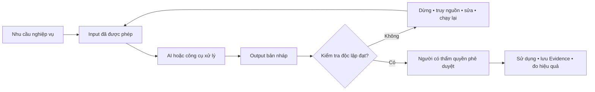
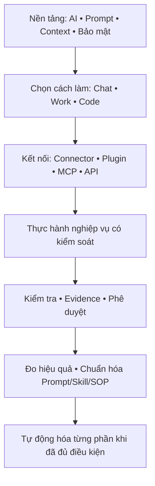
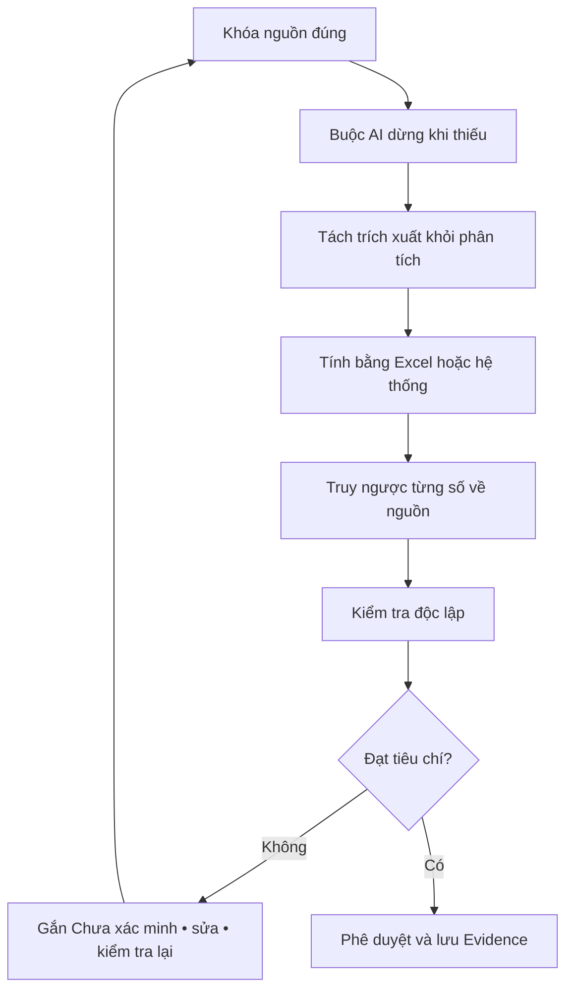
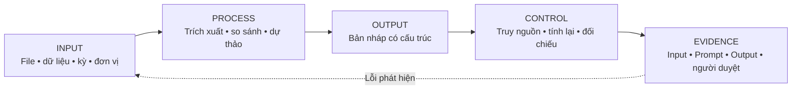
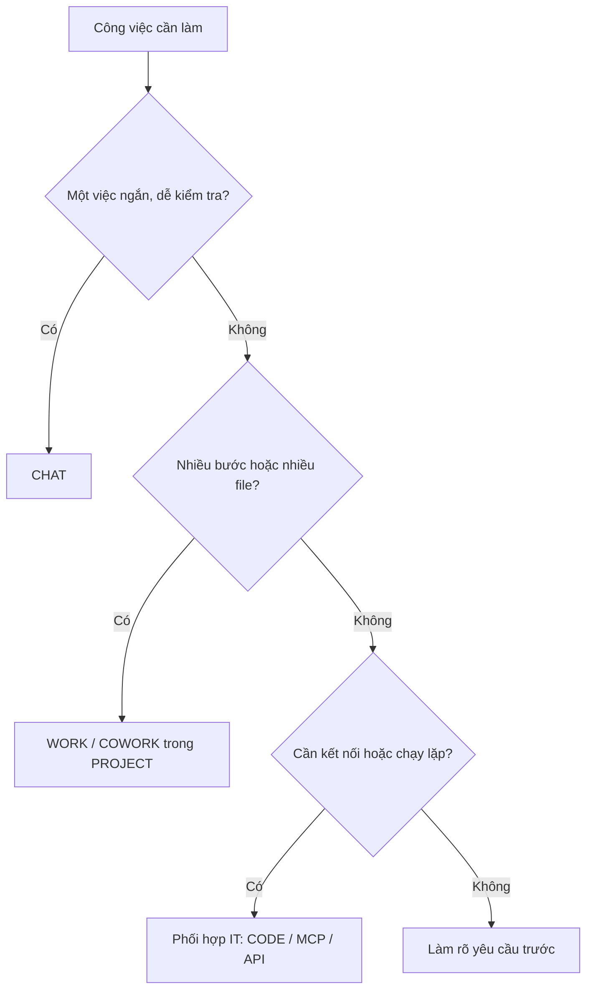
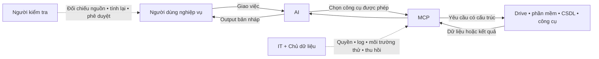
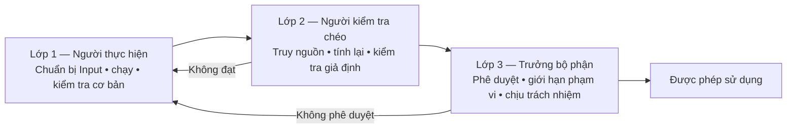

# Cẩm nang đào tạo và ứng dụng AI cho nhân sự không chuyên IT

_Khung dùng chung cho Kế toán, Marketing và các bộ phận nghiệp vụ — ví dụ chuyên sâu ưu tiên Kế toán._

> [!TIP]
> Để xem sơ đồ, mở file bằng công cụ hỗ trợ Mermaid như GitHub, GitLab, Obsidian hoặc VS Code có tiện ích Markdown/Mermaid. Nếu công cụ không dựng sơ đồ, nội dung chữ ngay dưới mỗi sơ đồ vẫn mô tả đầy đủ quy trình.

> [!IMPORTANT]
> AI là công cụ hỗ trợ tạo bản nháp, xử lý thông tin và gọi công cụ được cấp quyền. AI không phải nguồn sự thật, không tự chịu trách nhiệm nghề nghiệp và không thay người phê duyệt. Mọi kết quả có ảnh hưởng đến tiền, thuế, khách hàng, dữ liệu cá nhân, pháp lý hoặc thương hiệu phải được kiểm tra độc lập.

## Tổng quan dành cho người không chuyên IT

Bạn không cần biết lập trình để học tài liệu này. Với mỗi khái niệm, chỉ cần trả lời được sáu câu hỏi:

1. Nó là gì?
2. Vì sao cần nó?
3. Dữ liệu đi vào từ đâu?
4. Nó tạo ra hoặc thay đổi điều gì?
5. Con người kiểm tra ở đâu?
6. Khi nào phải dừng và hỏi người có thẩm quyền hoặc IT?

### Cùng một nguyên tắc, khác dữ liệu nghiệp vụ

| Thành phần | Kế toán | Marketing | Kiểm soát chung |
| --- | --- | --- | --- |
| Input | Sổ, chứng từ, công nợ, ngân sách | Brief, dữ liệu chiến dịch, nội dung, insight khách hàng | Đúng nguồn, đúng phiên bản, được phép sử dụng |
| AI hỗ trợ | Đối chiếu, trích xuất, dự thảo báo cáo | Dự thảo nội dung, phân nhóm phản hồi, tổng hợp hiệu quả | Không tự tạo dữ kiện hoặc cam kết |
| Output | Bảng kiểm tra, email, báo cáo, SOP | Bản nháp nội dung, báo cáo chiến dịch, lịch nội dung | Luôn mang trạng thái bản nháp trước kiểm tra |
| Rủi ro trọng yếu | Sai số, sai kỳ, sai thuế, lộ dữ liệu | Sai thông điệp, bịa insight, vi phạm bản quyền hoặc thương hiệu | Truy nguồn, kiểm tra chuyên môn, phê duyệt |
| Người duyệt | Kế toán trưởng hoặc người được phân quyền | Trưởng Marketing hoặc chủ sở hữu thương hiệu | Con người chịu trách nhiệm cuối cùng |

### Bản đồ nội dung

## Nội dung đào tạo chi tiết — trọng tâm Kế toán

Tài liệu tự học và thực hành từ cơ bản đến ứng dụng công việc

Đối tượng  Nhân viên kế toán, Kế toán trưởng và người kiểm tra

Phạm vi  Toàn công ty và Be Better Foundation

Phiên bản  2.3 ngày 21/09/2026

## Cách sử dụng cẩm nang

Tài liệu được viết cho người chưa rành công nghệ. Người học không cần biết lập trình và không cần ghi nhớ toàn bộ tính năng của các công cụ AI. Mục tiêu là làm đúng một quy trình đơn giản: chuẩn bị dữ liệu, giao việc rõ ràng cho AI, kiểm tra bằng nghiệp vụ và lưu lại bằng chứng.

### Cách đọc theo vai trò

Người mới hoàn toàn: Học theo thứ tự từ Phần 1 đến Phần 4. Không bỏ qua bài về bảo mật, Input và kiểm tra Output.

Người đã biết dùng chat: Đọc nhanh Phần 1, sau đó làm các Bài 3, 4, 5 và chọn ít nhất ba bài nghiệp vụ trong Phần 3.

Kế toán trưởng: Đọc Phần 1 và Phần 2 để thống nhất nguyên tắc, dùng Bảng dành riêng cho Kế toán trưởng để chọn use case, sau đó triển khai Phần 4 và bộ biểu mẫu ở Phần 5.

### Nguyên tắc thực hành

- [ ] Mỗi bài phải tạo ra một sản phẩm có thể lưu và kiểm tra; chỉ đọc mà không thực hành chưa được tính là hoàn thành.

- [ ] Khi mới thực hành, chỉ sử dụng dữ liệu mẫu hoặc dữ liệu đã ẩn thông tin nhạy cảm.

- [ ] Mọi Output của AI đều là bản nháp cho đến khi người có chuyên môn kiểm tra.

- [ ] Mỗi bài phải chỉ rõ lỗi phát hiện, phần đã sửa và bằng chứng kiểm tra.

- [ ] Chỉ chuẩn hóa prompt hoặc SOP khi một người khác có thể thực hiện lại thành công.

### Cấu trúc cố định của mỗi bài

1. Mục tiêu và kết quả cần đạt.

2. Giải thích khái niệm bằng ngôn ngữ đơn giản.

3. Input cần chuẩn bị và cách kiểm tra Input.

4. Thao tác từng bước trên công cụ AI.

5. Prompt mẫu có thể sao chép.

6. Output kỳ vọng và cách kiểm tra Output.

7. Lỗi thường gặp, bài nộp và tiêu chí hoàn thành.

## Mục lục nội dung

1. Phần 1 Nền tảng dành cho mọi nhân viên

2. Phần 2 Bảng tổng quát nội dung cần làm chủ

3. Phần 3 Mười lăm bài học thực hành cho phòng Kế toán

4. Phần 4 Hướng dẫn riêng cho Kế toán trưởng

5. Phần 5 Thư viện prompt biểu mẫu kiểm soát và đánh giá

6. Phụ lục Thuật ngữ và câu hỏi thường gặp

Mỗi phần tập trung vào kiến thức cần hiểu, Input cần chuẩn bị, thao tác thực hiện, Output kỳ vọng và cách kiểm tra. Người đọc có thể chọn nội dung theo vai trò nhưng không được bỏ qua các nguyên tắc bảo mật và kiểm soát Output.

## Phần 1 Nền tảng dành cho mọi nhân viên

### 1 Mục tiêu của chương trình

Yêu cầu của công ty có hai mục tiêu kinh doanh: giảm chi phí vận hành và tăng tốc độ xử lý công việc. Vì vậy, việc học AI không được đo bằng số tính năng đã xem mà phải đo bằng thời gian tiết kiệm, số lỗi giảm, chất lượng đầu ra và khả năng dùng lại trong bộ phận.

- Biết chọn đúng công cụ và mức mô hình cho từng tác vụ.

- Biết chuẩn bị Input rõ ràng, không đưa dữ liệu không được phép vào AI.

- Biết viết prompt và instruction để AI làm đúng phạm vi.

- Biết kiểm tra số liệu, nguồn, giả định và phần AI suy diễn.

- Biết phối hợp với IT khi cần connector, MCP, API hoặc tự động hóa.

- Biết chuyển cách làm hiệu quả thành prompt, checklist, project hoặc SOP dùng chung.

### 2 Bản chất của AI bằng ngôn ngữ đơn giản

AI tạo câu trả lời dựa trên dữ liệu được cung cấp và các mẫu mà mô hình đã học. AI có thể đọc nhanh, tóm tắt, phân loại, so sánh, dự thảo và gợi ý. AI không tự biết sổ kế toán nào là đúng, chứng từ nào là bản mới nhất hoặc quy định nào đang có hiệu lực nếu người dùng không cung cấp và không yêu cầu kiểm tra.

Điểm mạnh: Xử lý nhanh khối lượng chữ lớn; tạo bản nháp; tìm điểm khác nhau; đề xuất cấu trúc; chuyển nội dung giữa bảng, email, báo cáo và SOP.

Điểm yếu: Có thể bịa số liệu hoặc nguồn; tính toán sai; hiểu sai kỳ báo cáo; bỏ qua ngoại lệ; trả lời rất tự tin dù thiếu dữ liệu.

Kết luận thực hành: AI là trợ lý làm bản nháp và hỗ trợ kiểm tra. Người làm kế toán vẫn chịu trách nhiệm về số liệu, hạch toán, thuế, hồ sơ và quyết định cuối cùng.

### 2.1 Hàng rào an toàn để hạn chế AI bịa số và tính sai

Không có câu lệnh nào bảo đảm AI đúng 100 phần trăm. Cách an toàn là không cho AI trở thành nguồn sự thật hoặc máy tính cuối cùng. Người mới chỉ cần thực hiện đủ bảy bước dưới đây; thiếu một bước thì Output vẫn mang trạng thái Bản nháp, chưa được gửi hoặc ghi sổ.

Bước 1 — Khóa nguồn đúng: Chỉ làm trên bản sao; ghi rõ tên file, phiên bản, kỳ báo cáo, đơn vị tiền tệ và hệ thống xuất dữ liệu. Yêu cầu AI lập danh sách file đã đọc và file không đọc được. Không cho AI tự chọn giữa hai phiên bản mâu thuẫn.

Bước 2 — Buộc AI dừng khi thiếu dữ liệu: Ghi rõ “không được đoán, nội suy hoặc điền số còn thiếu”. Nếu thiếu cột, sai kỳ, không rõ đơn vị hoặc có số mâu thuẫn, AI phải dừng và đặt câu hỏi.

Bước 3 — Tách lấy dữ liệu khỏi phân tích: Lượt đầu chỉ yêu cầu trích xuất dữ liệu kèm vị trí nguồn; kế toán xác nhận bảng trích xuất rồi mới cho AI so sánh, nhận xét hoặc soạn báo cáo.

Bước 4 — Tính bằng công cụ có thể kiểm tra: Tổng, tỷ lệ, thuế, chênh lệch và quy đổi phải có công thức trong Excel hoặc hệ thống kế toán. Có thể nhờ AI gợi ý công thức, nhưng kết quả phát hành phải lấy từ Excel hoặc hệ thống và được tính lại; không chép số chỉ xuất hiện trong câu trả lời AI.

Bước 5 — Bắt buộc truy ngược nguồn: Mỗi số trọng yếu phải có cột Nguồn gồm tên file, sheet hoặc trang, dòng hoặc ô nếu có. Số không truy được nguồn phải gắn nhãn Chưa xác minh và không được đưa vào kết luận.

Bước 6 — Kiểm tra độc lập: Đối chiếu tổng kiểm soát, số dư đầu kỳ cộng phát sinh bằng số dư cuối kỳ, dấu âm dương, đơn vị, kỳ và ít nhất năm dòng mẫu hoặc toàn bộ khoản trọng yếu. Việc yêu cầu chính AI “kiểm tra lại” không được coi là kiểm tra độc lập; hỏi thêm một AI khác cũng không thay thế Excel, chứng từ, sổ hoặc người kiểm tra chéo.

Bước 7 — Phê duyệt trước khi dùng: Lưu Input, prompt, Output AI, file Excel tính lại, lỗi đã sửa và tên người kiểm tra. Chỉ bản đã kiểm tra và phê duyệt mới được dùng để gửi quản lý, khách hàng, cơ quan nhà nước hoặc làm căn cứ hạch toán.

Ba trạng thái dễ nhớ

XANH — AI dùng để sửa câu, định dạng, tạo checklist hoặc tóm tắt nội dung đã được xác nhận; người dùng vẫn đọc lại trước khi gửi.

VÀNG — AI trích xuất, đối chiếu, phân tích hoặc gợi ý công thức; bắt buộc truy nguồn, tính lại bằng Excel hoặc hệ thống và có người kiểm tra.

ĐỎ — Không giao AI tự quyết định bút toán, kê khai thuế, tính lương để chi trả, thay đổi dữ liệu gốc, phê duyệt thanh toán hoặc kết luận hồ sơ hợp lệ. Không dùng Output khi thiếu nguồn, sai kỳ, không rõ đơn vị hoặc không cân tổng.

Prompt chống bịa số có thể sao chép

Chỉ sử dụng các file tôi cung cấp. Trước khi phân tích, hãy lập bảng kiểm Input gồm tên file, phiên bản, kỳ, đơn vị, số dòng hoặc số trang, phần không đọc được và mâu thuẫn. Không tự tạo, ước tính, nội suy hoặc điền số thiếu. Nếu thiếu dữ liệu, sai kỳ, không rõ đơn vị hoặc có mâu thuẫn, hãy dừng và đặt câu hỏi. Với mỗi số trong Output, ghi nguồn là file, sheet hoặc trang và dòng hoặc ô nếu xác định được. Tách rõ Dữ kiện, Phép tính, Giả định và Chưa xác minh. Hiển thị công thức cho mọi tổng, tỷ lệ và chênh lệch; tạo cột Tổng kiểm soát và Chênh lệch kiểm tra. Cuối cùng, liệt kê những phép tính kế toán phải làm lại bằng Excel hoặc hệ thống. Không kết luận hợp lệ, không đề xuất bút toán và không phát hành thay người có thẩm quyền.

Ví dụ kiểm tra số: Nếu AI báo tổng chi phí là 1.250.000.000 VND, kế toán không hỏi lại AI xem con số có đúng không. Kế toán dùng SUM trên đúng vùng dữ liệu, kiểm tra bộ lọc và dòng ẩn, đối chiếu tổng với sổ hoặc báo cáo nguồn, rồi ghi người kiểm tra và kết quả chênh lệch.

### 3 Mô hình năm bước Input Process Output Control Evidence

Input: File, số liệu, chứng từ, câu hỏi, kỳ báo cáo, đơn vị tiền tệ, quy định và mẫu cần theo.

Process: Các việc yêu cầu AI thực hiện như kiểm tra dữ liệu, tính toán, so sánh, phân tích, dự thảo hoặc đặt câu hỏi.

Output: Kết quả cần nhận, ví dụ bảng đối chiếu, báo cáo một trang, email, checklist hoặc SOP.

Control: Cách người dùng kiểm tra lại số liệu, nguồn, phép tính, giả định, quyền phê duyệt và bảo mật.

Evidence: Input đã dùng, prompt, Output AI, bản đã sửa, người duyệt, thời gian và lỗi phát hiện.

Nếu thiếu một trong năm phần trên, công việc chưa đủ điều kiện để chuẩn hóa. Đặc biệt, Output không có Control chỉ là nội dung tham khảo, không phải sản phẩm kế toán hoàn chỉnh.

### 4 Phân biệt Chat Work và Code

Chat: Dùng cho một câu hỏi hoặc một việc ngắn: giải thích khái niệm, viết email, tóm tắt một tài liệu, sửa câu chữ hoặc tạo checklist đơn giản.

Work hoặc CoWork: Dùng cho công việc nhiều bước và có nhiều file: đọc tài liệu, phân tích bảng, tạo báo cáo, lặp lại theo quy trình và duy trì ngữ cảnh trong Project.

Code: Dùng khi cần đọc hoặc sửa mã nguồn, xử lý dữ liệu lớn bằng chương trình, xây tích hợp và kiểm thử. Nhân viên kế toán không phải học viết mã; chỉ cần biết mô tả yêu cầu và tiêu chí nghiệm thu cho IT.

Quy tắc chọn: Nếu có thể hoàn thành bằng một cuộc trò chuyện và kiểm tra thủ công thì dùng Chat. Nếu có nhiều bước hoặc nhiều file thì dùng Work. Nếu phải kết nối hệ thống hoặc chạy tự động thì phối hợp IT dùng Code, MCP hoặc API.

### 5 Project Instruction Skill Connector Plugin và MCP

Project: Không gian làm việc theo một chủ đề, chứa conversation, instruction và tài liệu liên quan. Ví dụ Project Khóa sổ tháng hoặc Project Báo cáo dòng tiền.

Instruction: Quy tắc làm việc lâu dài của Project: vai trò của AI, phạm vi dữ liệu, định dạng báo cáo, điều cấm và cách kiểm tra.

Skill: Bộ hướng dẫn hoặc quy trình đóng gói để AI thực hiện một loại việc nhất quán. Người dùng nghiệp vụ cần biết chọn và áp dụng, không nhất thiết tự lập trình skill.

Connector và plugin: Cách công cụ AI truy cập dịch vụ hoặc nguồn dữ liệu đã được cấp quyền, ví dụ Drive hoặc hệ thống nội bộ. Phải kiểm tra quyền trước khi dùng.

MCP: Viết tắt của Model Context Protocol, nghĩa là giao thức giúp AI kết nối và sử dụng dữ liệu hoặc công cụ bên ngoài theo một cách thống nhất. MCP không phải là mô hình AI và không phải phần mềm kế toán.

### MCP được hiểu như thế nào trong công việc kế toán?

> MCP chỉ là cầu nối. Nguồn sai thì kết quả vẫn sai; quyền sai thì rủi ro vẫn xảy ra; AI hiểu sai thì Output vẫn phải bị chặn ở bước kiểm tra.

Cách hiểu đơn giản: AI là trợ lý; MCP là cổng giao tiếp có kiểm soát; Google Drive, phần mềm kế toán, cơ sở dữ liệu hoặc công cụ nội bộ là nơi chứa dữ liệu và chức năng. MCP cho AI biết có công cụ nào được phép dùng, cần gửi thông tin theo cấu trúc nào và kết quả được trả về ra sao.

Luồng hoạt động: Người dùng giao việc → AI xác định công cụ cần dùng → MCP chuyển yêu cầu tới đúng công cụ hoặc nguồn dữ liệu → công cụ trả kết quả → AI trình bày lại cho người dùng. Quyền truy cập vẫn do hệ thống và IT kiểm soát; MCP không tự tạo ra quyền.

Ví dụ: Công ty có thể thiết lập MCP chỉ cho phép AI đọc thư mục Công nợ đã duyệt. Khi kế toán yêu cầu lập danh sách hóa đơn sắp đến hạn, AI dùng MCP để đọc đúng dữ liệu được cấp quyền và tạo bản nháp. AI không được tự gửi email đòi nợ, sửa công nợ hoặc xác nhận số dư nếu các quyền đó không được cấp và chưa có người phê duyệt.

MCP không bảo đảm câu trả lời đúng. Nếu nguồn sai, quyền cấp sai, công cụ trả thiếu dữ liệu hoặc AI hiểu sai yêu cầu thì Output vẫn sai. Vì vậy số liệu nhận qua MCP vẫn phải truy được về nguồn, tính lại khi cần và qua người kiểm tra giống như file tải lên thủ công.

Nhân viên kế toán cần biết: mô tả nguồn nào cần dùng, trường dữ liệu nào cần đọc, Output mong muốn, điều AI không được làm và tiêu chí nghiệm thu. Nhân viên kế toán không tự cài MCP hoặc tự cấp quyền hệ thống; phần kết nối, bảo mật, log và thu hồi quyền do IT thực hiện cùng chủ sở hữu dữ liệu.

### MCP có thể ứng dụng vào việc gì?

1. Công nợ: Đọc bảng công nợ đã duyệt, phân nhóm đến hạn hoặc quá hạn và dự thảo danh sách cần theo dõi. Người phụ trách vẫn xác nhận số dư và quyết định liên hệ khách hàng.

2. Hồ sơ thanh toán: Đọc hợp đồng, hóa đơn, biên bản và đề nghị thanh toán trong đúng thư mục; lập bảng trường Khớp, Không khớp, Thiếu hoặc Không đọc được kèm vị trí nguồn. AI không phê duyệt thanh toán.

3. Khóa sổ: Đọc trạng thái checklist, tổng hợp việc chậm, phụ thuộc và bằng chứng còn thiếu; nhắc người phụ trách nhưng không tự tạo bút toán hoặc khóa kỳ.

4. Báo cáo quản trị: Lấy số liệu từ nguồn đã khóa phiên bản, điền vào mẫu và dự thảo nhận xét. Tổng, tỷ lệ và số liệu trọng yếu vẫn phải đối chiếu với báo cáo nguồn trước khi gửi.

5. Tra cứu tài liệu nội bộ: Tìm đúng SOP, chính sách hoặc biểu mẫu còn hiệu lực trong kho tài liệu được cấp quyền; trả tên tài liệu, phiên bản và đường dẫn để người dùng mở kiểm tra.

6. Công cụ kiểm tra: Gọi hàm hoặc chương trình đã được kiểm thử để tính tổng, kiểm tra dòng trùng, đối chiếu logic hoặc tạo file theo mẫu. Kết quả chỉ được tin trong phạm vi bộ dữ liệu và tiêu chí đã nghiệm thu.

### Cách triển khai một ứng dụng MCP

Bước 1 — Chọn việc phù hợp: Ưu tiên việc lặp lại, tốn thời gian, có Input rõ và Output dễ kiểm tra. Không bắt đầu bằng kê khai thuế cuối cùng, phê duyệt thanh toán hoặc ghi sổ tự động.

Bước 2 — Mô tả nghiệp vụ: Kế toán ghi nguồn dữ liệu, trường cần đọc, quy tắc, Output, ngoại lệ, người kiểm tra và tiêu chí Pass hoặc Fail.

Bước 3 — Thiết kế quyền: IT và chủ dữ liệu giới hạn đúng thư mục, trường và thao tác; thử ở chế độ chỉ đọc trước, không cấp quyền xóa hoặc ghi nếu chưa thực sự cần.

Bước 4 — Kiểm thử: Dùng dữ liệu mẫu gồm trường hợp đúng, sai, thiếu, trùng và ngoại lệ. So sánh Output với kết quả do kế toán lập trước và ghi từng lỗi.

Bước 5 — Chạy thử có giám sát: Dùng phạm vi nhỏ với dữ liệu thật đã phê duyệt; mọi Output đều có người kiểm tra và chưa được tự động phát hành.

Bước 6 — Nghiệm thu và theo dõi: Chỉ đưa vào sử dụng khi đạt tiêu chí về số liệu, quyền, log, thời gian và phương án quay lại. Rà soát quyền, lỗi và hiệu quả định kỳ.

### Khi nào chưa nên dùng MCP?

Chưa dùng khi quy trình còn thay đổi liên tục; dữ liệu nguồn chưa chuẩn; chưa xác định người chịu trách nhiệm; không có dữ liệu thử; không truy được log; cần quyền quá rộng; Output không thể kiểm tra độc lập; hoặc sai sót có thể gây thanh toán, kê khai, hạch toán hay tiết lộ dữ liệu không thể đảo ngược.

### Phân biệt nhanh

Connector: Kết nối có sẵn tới một dịch vụ cụ thể, ví dụ Google Drive. API: Giao diện để hai hệ thống trao đổi dữ liệu theo quy tắc đã định. MCP: Chuẩn để AI khám phá và gọi các dữ liệu hoặc công cụ được cung cấp. Plugin: Gói mở rộng có thể chứa công cụ, kết nối và hướng dẫn. Skill: Bộ hướng dẫn giúp AI thực hiện một loại việc nhất quán.

Câu hỏi tự kiểm tra: AI cần đọc nguồn nào? Chỉ đọc hay được ghi? Ai đã phê duyệt quyền? Có log không? Có dữ liệu thử và kết quả mong đợi không? Ai kiểm tra số liệu? Có thể thu hồi quyền và quay lại khi lỗi không? Nếu chưa trả lời đủ, chưa được dùng MCP với dữ liệu kế toán thật.

### 5.1 Cách bật kết nối mà không làm lộ hoặc sửa nhầm dữ liệu

1. Người dùng mô tả đúng nguồn cần truy cập, trường dữ liệu cần đọc, thao tác cần làm và Output mong muốn; không yêu cầu quyền toàn bộ hệ thống.

2. IT tạo môi trường thử và tài khoản dịch vụ có quyền tối thiểu; giai đoạn đầu ưu tiên chỉ đọc, không cho xóa, ghi sổ hoặc gửi ra ngoài.

3. Chuẩn bị bộ dữ liệu thử gồm trường hợp đúng, sai, thiếu, trùng và ngoại lệ; ghi trước kết quả mong đợi.

4. Kiểm tra log có ghi người gọi, thời gian, nguồn, thao tác và kết quả; thử thu hồi quyền và phương án quay lại khi lỗi.

5. Kế toán nghiệm thu theo số liệu và quy tắc nghiệp vụ, IT nghiệm thu bảo mật và vận hành; chỉ dùng dữ liệu thật sau khi cả hai bên ký xác nhận.

Dấu hiệu phải dừng: Công cụ yêu cầu quyền rộng hơn phạm vi, không có log, không phân biệt môi trường thử với thật, tự sửa dữ liệu nguồn hoặc không xác định được ai chịu trách nhiệm.

### 6 Bảo mật và phân loại dữ liệu

Trước khi tải file hoặc dán nội dung, người dùng phải biết dữ liệu thuộc mức nào. Khi chưa chắc chắn, phải coi dữ liệu ở mức cao hơn và hỏi Kế toán trưởng hoặc IT.

| Mức | Ví dụ | Cách xử lý |
| --- | --- | --- |
| Mức 1 Công khai | Thông tin đã công bố, biểu mẫu trống, quy định công khai | Có thể dùng trên tài khoản được công ty cho phép |
| Mức 2 Nội bộ | Quy trình, báo cáo không có dữ liệu cá nhân hoặc bí mật kinh doanh | Chỉ dùng tài khoản công ty và Project đúng phạm vi |
| Mức 3 Nhạy cảm | Số dư, công nợ, lương, thông tin nhân viên, khách hàng, hợp đồng | Ẩn thông tin hoặc xin phê duyệt; giới hạn quyền và người xem |
| Mức 4 Tuyệt mật | Mật khẩu, API key, token, tài khoản ngân hàng cá nhân, dữ liệu sản xuất chưa kiểm soát | Không đưa vào công cụ AI; phối hợp IT theo quy trình riêng |

#### Cách ẩn dữ liệu

1. Tạo một bản sao dùng cho học tập, không sửa file gốc.

2. Thay tên công ty, nhân viên, khách hàng và nhà cung cấp bằng mã giả như CTY A, NV 01 và NCC 03.

3. Che số tài khoản, mã số thuế, số hợp đồng và thông tin liên hệ nếu không cần cho bài tập.

4. Giữ lại cấu trúc và quan hệ dữ liệu cần phân tích; không thay đổi số theo cách làm sai bài toán.

5. Lưu file đã ẩn dữ liệu vào thư mục Input mẫu và ghi rõ đây là dữ liệu huấn luyện.

#### Checklist trước khi tải file

- [ ] Đang dùng tài khoản công ty được phép.

- [ ] Biết dữ liệu thuộc mức nào và ai đã phê duyệt.

- [ ] Đã xóa mật khẩu, token, API key và thông tin đăng nhập.

- [ ] Đã ẩn dữ liệu cá nhân hoặc bí mật không cần thiết.

- [ ] Đã kiểm tra đúng phiên bản file và đúng phạm vi thời gian.

- [ ] Biết Output sẽ được lưu ở đâu và ai được xem.

### 7 Thiết lập môi trường học và làm việc

1. Cài ứng dụng máy tính của Claude và ChatGPT hoặc Codex theo hướng dẫn của IT. Gemini đăng nhập bằng tài khoản công ty.

2. Nếu chưa có tài khoản riêng, dùng email công ty đăng ký tài khoản miễn phí. Không tự mua gói bằng thông tin công ty nếu chưa được duyệt.

3. Tạo thư mục AI Kế toán gồm 01 Input mẫu, 02 Prompt, 03 Output AI, 04 Bản đã kiểm tra và 05 SOP.

4. Tạo Project Kế toán AI Tên người học. Thêm instruction mẫu ở mục hướng dẫn của Project hoặc đầu cuộc trò chuyện nếu công cụ chưa có Project.

5. Tạo một conversation riêng cho từng nghiệp vụ. Không trộn dòng tiền, thuế, hợp đồng và nhân sự vào cùng một conversation.

#### Instruction mẫu cho Project kế toán

> **Nội dung có thể sao chép:** Bạn là trợ lý hỗ trợ nghiệp vụ kế toán. Chỉ sử dụng dữ liệu tôi cung cấp. Không tự tạo số liệu, chứng từ, nguồn hoặc kết luận pháp lý. Nếu thiếu dữ liệu, hãy dừng và liệt kê phần thiếu trước khi phân tích. Luôn tách rõ dữ kiện, giả định, phép tính, điểm cần xác minh và kiến nghị. Mọi số tiền phải ghi đơn vị và kỳ báo cáo. Khi sử dụng quy định, phải nêu tên văn bản, điều khoản, ngày hiệu lực, nguồn chính thức và ngày truy cập. Output chỉ là bản nháp; phải nhắc người phụ trách đối chiếu sổ, chứng từ và phê duyệt trước khi sử dụng.

### 8 Công thức prompt sáu phần

1 Vai trò và bối cảnh: Nói bạn là ai, đang làm nghiệp vụ gì, cho công ty hoặc kỳ nào.

2 Mục tiêu: Nói chính xác việc cần AI hoàn thành, tránh yêu cầu chung chung như phân tích giúp tôi.

3 Input: Nêu file nào được dùng, ý nghĩa cột, nguồn dữ liệu, đơn vị và phần còn thiếu.

4 Quy tắc và giới hạn: Nêu điều AI không được làm, ngưỡng cảnh báo, phạm vi và quy định phải theo.

5 Định dạng Output: Nêu bảng, email, checklist, báo cáo, số cột, độ dài và người đọc.

6 Cách kiểm tra: Yêu cầu AI tách giả định, nêu phép tính, liệt kê dữ liệu thiếu và tạo checklist đối chiếu.

#### Prompt mẫu dùng cho mọi nghiệp vụ

> **Nội dung có thể sao chép:** Vai trò và bối cảnh: Tôi là [vị trí] đang thực hiện [nghiệp vụ] cho kỳ [thời gian], đơn vị tiền tệ [đơn vị]. Mục tiêu: Hãy [việc cần hoàn thành]. Input: Chỉ sử dụng [file hoặc nội dung]; ý nghĩa các cột là [mô tả]. Quy tắc: Không tự đoán dữ liệu thiếu; không kết luận pháp lý; áp dụng ngưỡng [ngưỡng]. Output: Trả kết quả theo dạng [bảng, checklist, email hoặc báo cáo], gồm [các mục bắt buộc], dành cho [người đọc]. Kiểm tra: Tách rõ dữ kiện, giả định và điểm cần xác minh; nêu phép tính hoặc nguồn; cuối cùng tạo checklist để kế toán đối chiếu.

#### Ví dụ prompt yếu và prompt tốt

Prompt yếu: Xem file này và phân tích giúp tôi.

Vì sao yếu: Không có kỳ, đơn vị, mục tiêu, ý nghĩa cột, ngưỡng, định dạng Output hoặc cách kiểm tra. AI có thể trả lời dài nhưng không dùng được.

Prompt tốt: Phân tích chi phí tháng 08/2026 trong file đính kèm, đơn vị VND. So sánh Thực tế với Ngân sách và tháng trước. Đánh dấu khoản chênh trên 10 phần trăm hoặc 50 triệu đồng. Không tự kết luận nguyên nhân; tạo tối đa ba câu hỏi xác minh cho mỗi khoản. Output gồm bảng chi tiết và tóm tắt 200 từ cho Kế toán trưởng.

### 9 Cách làm việc qua nhiều lượt

Không cần cố viết một prompt hoàn hảo ngay từ đầu. Một quy trình tốt thường có bốn lượt, mỗi lượt giải quyết một mục tiêu rõ ràng.

1. Lượt 1 Kiểm tra Input: yêu cầu AI liệt kê cột thiếu, dòng trùng, lỗi định dạng và câu hỏi cần trả lời.

2. Lượt 2 Xác nhận phạm vi: trả lời câu hỏi, bổ sung dữ liệu và yêu cầu AI nhắc lại cách hiểu trước khi phân tích.

3. Lượt 3 Tạo Output: yêu cầu bảng hoặc báo cáo theo mẫu đã định.

4. Lượt 4 Tự kiểm tra: yêu cầu AI rà lại phép tính, giả định, mâu thuẫn và tạo checklist; sau đó người dùng kiểm tra độc lập.

### 10 Cách kiểm tra Output của AI

Người học sử dụng quy tắc năm kiểm tra dưới đây cho mọi Output. Nếu không thể hoàn thành một bước, phải ghi rõ chưa kiểm tra và không phát hành kết quả.

| Nhóm kiểm tra | Câu hỏi bắt buộc |
| --- | --- |
| Kiểm tra nguồn | File, chứng từ, văn bản, ngày hiệu lực và phiên bản có đúng không |
| Kiểm tra số | Tổng, dấu âm dương, đơn vị, tỷ lệ, làm tròn và phép tính mẫu có khớp không |
| Kiểm tra phạm vi | Đúng công ty, kỳ, tài khoản, loại tiền, loại thuế và đối tượng đọc không |
| Kiểm tra suy diễn | Phần nào là dữ kiện, giả định, nhận xét, kiến nghị hoặc nội dung chưa xác minh |
| Kiểm tra phê duyệt | Ai lập, ai kiểm tra, ai duyệt và Output được phép dùng cho việc gì |

#### Dấu hiệu Output không đáng tin

- Có số liệu không tìm thấy trong Input.

- Dẫn nguồn không mở được hoặc văn bản không đúng kỳ.

- Dùng từ chắc chắn dù Input thiếu hoặc có mâu thuẫn.

- Tổng số không khớp các dòng chi tiết.

- Đổi đơn vị hoặc tỷ giá mà không giải thích.

- Kết luận nguyên nhân nhưng không có chứng từ hoặc xác nhận của bộ phận liên quan.

### Cách xử lý khi xuất hiện một dấu hiệu trên

1. Không sửa trực tiếp trên Output và tiếp tục phát hành. Đổi trạng thái thành Chưa xác minh, ghi rõ dấu hiệu lỗi và phạm vi bị ảnh hưởng.

2. Quay lại đúng nguồn: mở file, chứng từ hoặc văn bản; kiểm tra phiên bản, kỳ, đơn vị và vị trí dữ liệu. Nếu không truy được nguồn, loại nội dung đó khỏi kết luận.

3. Với số liệu, tính lại bằng Excel hoặc hệ thống và đối chiếu tổng; với nguồn pháp lý, mở văn bản chính thức và kiểm tra hiệu lực; với nguyên nhân, xin xác nhận của bộ phận liên quan.

4. Sửa Input hoặc prompt, tạo Output mới và so sánh phần thay đổi. Không coi việc AI tự nhận lỗi là bằng chứng đã sửa đúng.

5. Lưu lỗi, cách phát hiện, cách sửa và người kiểm tra vào Evidence. Nếu lỗi ảnh hưởng báo cáo đã gửi, báo ngay Kế toán trưởng để xử lý phiên bản và người nhận.

### 11 Làm việc với Excel PDF hình ảnh và nhiều file

#### Chuẩn bị Excel

- Một dòng là một giao dịch hoặc một đối tượng; không gộp nhiều nội dung vào một ô.

- Dòng đầu là tiêu đề cột ngắn và rõ; tránh merge cell trong vùng dữ liệu.

- Ngày dùng cùng một định dạng; số tiền lưu dạng số; ô trống phải có ý nghĩa rõ.

- Thêm cột Nguồn, Trạng thái xác nhận và Ghi chú khi cần kiểm soát.

- Xóa dòng tổng thủ công nếu AI phải tính lại; giữ một sheet mô tả ý nghĩa cột.

#### Chuẩn bị PDF và hình ảnh

- Ưu tiên PDF có thể chọn được chữ. Nếu là bản scan, chạy OCR trên bản sao rồi đối chiếu tối thiểu số trang, tên pháp nhân, ngày, số chứng từ, số tiền, thuế suất và tổng thanh toán; trường trọng yếu phải kiểm tra toàn bộ. Nếu ký tự hoặc số không rõ, gắn Không đọc được và xin bản rõ hơn, không tự đoán.

- Ảnh phải thẳng, đủ sáng, không mất góc, nhìn rõ số tiền và ngày tháng.

- Đánh số file theo thứ tự Hợp đồng, Phụ lục, Hóa đơn, Biên bản và Đề nghị thanh toán.

- Yêu cầu AI ghi vị trí hoặc trang lấy thông tin để kế toán kiểm tra lại.

#### Làm việc với nhiều file

Trước khi yêu cầu phân tích, cung cấp danh sách file và vai trò của từng file. Yêu cầu AI lập bảng file đã đọc, file không đọc được và phiên bản có thể mâu thuẫn. Không yêu cầu AI tự chọn bản đúng khi không có tiêu chí phiên bản.

### 12 Tra cứu và Deep Research

Deep Research phù hợp khi cần tổng hợp nhiều nguồn, so sánh quy định hoặc chuẩn bị câu hỏi cho tư vấn. Không dùng Deep Research để thay thế quyết định kế toán, thuế hoặc pháp lý.

1. Viết câu hỏi có quốc gia, loại thuế, kỳ phát sinh, bản chất giao dịch và dữ kiện cụ thể.

2. Yêu cầu ưu tiên nguồn chính thức của cơ quan nhà nước, cơ quan thuế, chuẩn mực hoặc hãng cung cấp công cụ.

3. Yêu cầu ghi tên văn bản, số hiệu, điều khoản, ngày hiệu lực, đường dẫn và ngày truy cập.

4. Mở từng nguồn để kiểm tra, không chỉ đọc phần AI tóm tắt.

5. Ghi rõ điểm còn mâu thuẫn, dữ kiện thiếu và câu hỏi phải gửi tư vấn hoặc kiểm toán.

## Phần 2 Bảng tổng quát nội dung cần làm chủ

Bảng dưới đây cho biết toàn bộ nhóm kiến thức bắt buộc, cách áp dụng vào công việc và sản phẩm cần tạo ra. Mỗi bộ phận được thay tình huống thực hành theo nghiệp vụ nhưng phải giữ nguyên nguyên tắc bảo mật, kiểm tra Output và phê duyệt của con người.

| Nhóm nội dung | Cần hiểu | Cách áp dụng | Output cần có | Người kiểm tra |
| --- | --- | --- | --- | --- |
| Bản chất và giới hạn của AI | Điểm mạnh, điểm yếu, hallucination và trách nhiệm của người dùng | Phân biệt phần AI có thể hỗ trợ với phần con người phải quyết định | Danh sách việc được dùng AI, việc cần kiểm soát và việc không được giao AI | Trưởng bộ phận |
| Bảo mật và phân loại dữ liệu | Bốn mức dữ liệu, tài khoản được phép, cách ẩn thông tin và phân quyền | Phân loại file mẫu, tạo bản đã ẩn dữ liệu và kiểm tra trước khi tải lên | Bảng phân loại dữ liệu và file mẫu không còn thông tin không cần thiết | Kế toán trưởng hoặc IT |
| Input Process Output Control Evidence | Cách định nghĩa đầu vào, thao tác, đầu ra, kiểm soát và bằng chứng | Mô tả một nghiệp vụ thật theo năm thành phần trước khi dùng AI | Phiếu giao việc có AI với phạm vi và trách nhiệm rõ ràng | Người kiểm tra chéo |
| Prompt và làm việc nhiều lượt | Công thức prompt sáu phần, câu hỏi làm rõ và cách sửa prompt | So sánh prompt yếu với prompt tốt trên cùng một Input | Prompt dùng lại được, Output đúng cấu trúc và checklist kiểm tra | Trưởng bộ phận |
| Project Instruction và chọn công cụ | Project, instruction, Chat, Work, CoWork, Code, ưu nhược điểm và chi phí mô hình | Tạo Project theo nghiệp vụ và chọn công cụ phù hợp cho từng loại tác vụ | Project có instruction chuẩn và bảng quy tắc chọn công cụ | Chủ sở hữu nghiệp vụ |
| Excel PDF hình ảnh và nhiều file | Chuẩn hóa bảng, OCR, đặt tên file, kiểm tra phiên bản và nguồn dữ liệu | Yêu cầu AI kiểm tra cấu trúc và chất lượng Input trước khi phân tích | Bảng lỗi dữ liệu, danh sách file đã đọc và phần cần xác minh | Người lập và người kiểm tra |
| Tra cứu và Deep Research | Cách đặt câu hỏi, ưu tiên nguồn chính thức, kiểm tra hiệu lực và xử lý nguồn mâu thuẫn | Nghiên cứu một vấn đề kế toán hoặc thuế dựa trên factsheet đã chuẩn bị | Bảng nhận định có văn bản, điều khoản, nguồn và mức độ chắc chắn | Kế toán trưởng hoặc tư vấn |
| Ứng dụng nghiệp vụ kế toán | Dữ liệu, dòng tiền, chi phí, hợp đồng, hóa đơn, khóa sổ, BCTC, thuế và ngoại tệ | Thực hiện từng use case từ Input đến Output, kiểm tra chéo và phê duyệt | Bảng phân tích, báo cáo hoặc checklist có thể truy ngược về nguồn | Kế toán trưởng |
| Chuẩn hóa SOP và tài sản dùng chung | Cấu trúc SOP, quản lý phiên bản, kiểm thử và điều kiện nhân rộng | Chuyển một cách làm hiệu quả thành prompt, checklist, Project hoặc SOP | Tài liệu dùng chung mà người khác có thể thực hiện lại thành công | Chủ sở hữu quy trình |
| Connector Plugin Skill MCP và tự động hóa | Khái niệm kết nối, quyền tối thiểu, log, dữ liệu thử, tiêu chí nghiệm thu và quay lại | Viết yêu cầu nghiệp vụ cho IT, không yêu cầu nhân viên kế toán tự viết mã | Tài liệu yêu cầu tự động hóa có phạm vi, kiểm soát và nghiệm thu rõ ràng | Kế toán trưởng và IT |

## Phần 3 Mười lăm bài học thực hành cho phòng Kế toán

Mười lăm bài được sắp từ nền tảng đến nghiệp vụ chuyên sâu. Người học làm bằng dữ liệu mẫu trước, sau đó mới chuyển sang công việc thật đã được Kế toán trưởng phê duyệt. Mỗi bài tập trung vào Input, thao tác, Output và cách kiểm tra.

## Bài 1 Làm quen công cụ và bảo mật dữ liệu

Kết quả sau bài học: Đăng nhập đúng tài khoản, tạo được thư mục học, phân loại được dữ liệu và biết nội dung không được đưa vào AI.

### Kiến thức cần hiểu

Tài khoản công ty là ranh giới đầu tiên để quản lý quyền truy cập và dữ liệu. Việc một công cụ cho phép tải file không có nghĩa mọi file đều được phép tải. Người dùng phải xác định mức dữ liệu trước khi thao tác.

### Input cần chuẩn bị

- Một file Excel mẫu không chứa dữ liệu thật.

- Một hợp đồng mẫu hoặc văn bản công khai.

- Danh sách mười loại dữ liệu thường gặp trong phòng Kế toán.

### Thao tác từng bước

1. Đăng nhập ChatGPT, Claude và Gemini bằng tài khoản được công ty chấp thuận.

2. Tạo thư mục AI Kế toán theo cấu trúc trong Phần 1.

3. Tạo Project Kế toán AI Tên người học và dán instruction mẫu.

4. Phân loại mười loại dữ liệu vào bốn mức Công khai, Nội bộ, Nhạy cảm và Tuyệt mật.

5. Chọn ba trường thông tin cần ẩn trong file mẫu, tạo bản sao và thay bằng mã giả.

6. Tải bản đã ẩn dữ liệu, yêu cầu AI mô tả file và kiểm tra xem AI có phát hiện đúng cột hay không.

7. Xóa file khỏi cuộc trò chuyện nếu quy định nội bộ yêu cầu và lưu bằng chứng kiểm tra vào đúng thư mục.

### Prompt thực hành

> **Nội dung có thể sao chép:** Hãy kiểm tra cấu trúc file đính kèm mà không phân tích nghiệp vụ. Liệt kê tên sheet, tên cột, số dòng, kiểu dữ liệu, ô trống, cột có khả năng chứa thông tin nhạy cảm và câu hỏi cần người dùng xác nhận. Không hiển thị lại toàn bộ dữ liệu trong câu trả lời.

### Output kỳ vọng

Danh sách sheet và cột, cảnh báo dữ liệu nhạy cảm, lỗi định dạng và câu hỏi xác nhận. Output không được lặp lại nguyên văn danh sách nhân viên, tài khoản hoặc thông tin cá nhân.

### Lỗi thường gặp và cách xử lý ngay

- Dùng tài khoản cá nhân vì thao tác nhanh hơn — Dừng tải dữ liệu, đăng xuất và chuyển sang tài khoản công ty được duyệt; nếu đã tải file, báo Kế toán trưởng hoặc IT và xử lý theo quy trình sự cố dữ liệu.

- Tải file thật trước rồi mới nghĩ đến việc ẩn dữ liệu — Luôn tạo bản sao, phân loại và ẩn dữ liệu trước khi mở cuộc trò chuyện; lưu checklist phê duyệt cùng file đã ẩn.

- Cho rằng xóa tên công ty là đủ dù file vẫn còn số tài khoản hoặc thông tin nhân viên — Tìm thêm mã số thuế, tài khoản, email, điện thoại, mã nhân viên và thông tin hợp đồng; nhờ người khác kiểm tra lại bản đã ẩn trước khi tải.

### Bài thực hành phải nộp

Nộp ảnh hoặc ghi nhận cấu trúc thư mục, Project đã tạo, bảng phân loại mười loại dữ liệu và Output kiểm tra cấu trúc file mẫu.

### Tiêu chí hoàn thành

- [ ] Đăng nhập đúng tài khoản.

- [ ] Phân loại đúng ít nhất chín trên mười loại dữ liệu.

- [ ] File mẫu không còn thông tin nhạy cảm không cần thiết.

- [ ] Biết nêu người cần hỏi khi không chắc dữ liệu có được phép dùng hay không.

## Bài 2 Viết prompt rõ ràng và sửa prompt theo kết quả

Kết quả sau bài học: Viết được prompt sáu phần, nhận ra prompt yếu và biết cải thiện Output qua nhiều lượt.

### Input cần chuẩn bị

Một email báo cáo cũ đã ẩn thông tin, một bảng số liệu năm dòng và một yêu cầu chung chung như phân tích giúp tôi.

### Thao tác từng bước

1. Gửi yêu cầu chung chung và lưu Output lần đầu để làm mốc so sánh.

2. Viết lại yêu cầu theo sáu phần: bối cảnh, mục tiêu, Input, quy tắc, Output và kiểm tra.

3. Yêu cầu AI nhắc lại cách hiểu và liệt kê dữ liệu còn thiếu trước khi làm.

4. Bổ sung dữ liệu hoặc xác nhận phần được phép để trống.

5. Yêu cầu tạo Output lần hai theo đúng định dạng.

6. Yêu cầu AI tự rà soát số liệu, giả định và điểm mâu thuẫn.

7. So sánh hai Output và ghi ba điểm bản thứ hai tốt hơn.

### Prompt thực hành

> **Nội dung có thể sao chép:** Tôi là nhân viên kế toán đang chuẩn bị email báo cáo [nghiệp vụ] cho [người nhận] trong kỳ [thời gian]. Chỉ sử dụng số liệu dưới đây. Hãy viết email tối đa 180 từ, gồm: kết luận chính, ba số liệu trọng yếu, rủi ro hoặc việc còn thiếu và hành động cần người nhận quyết định. Không tự thêm nguyên nhân. Nếu dữ liệu thiếu, hãy hỏi trước khi viết. Sau email, tạo checklist năm điểm để tôi đối chiếu.

### Cách tự kiểm tra

- [ ] Prompt có kỳ và đơn vị tiền tệ.

- [ ] Nêu rõ người đọc và mục đích.

- [ ] Không yêu cầu AI tự suy đoán nguyên nhân.

- [ ] Output có giới hạn độ dài và cấu trúc.

- [ ] Có bước kiểm tra cuối.

### Lỗi thường gặp và cách xử lý ngay

- Đưa quá nhiều mục tiêu vào một prompt — Tách thành các lượt Kiểm tra Input, Xác nhận phạm vi, Tạo Output và Kiểm tra; mỗi lượt chỉ có một kết quả cần nhận.

- Chỉ nói viết chuyên nghiệp nhưng không mô tả người đọc và quyết định cần xin — Bổ sung người nhận, mục đích, kỳ, giới hạn độ dài và quyết định hoặc hành động mong muốn trước khi chạy lại.

- Sửa từng câu bằng tay nhưng không sửa prompt, khiến lỗi lặp lại ở lần sau — Ghi lỗi vào nhật ký, sửa đúng phần instruction hoặc prompt gây lỗi và thử lại bằng một Input khác trước khi lưu dùng chung.

### Bài thực hành phải nộp

Nộp prompt yếu, prompt đã cải thiện, hai Output và đoạn nhận xét ngắn về khác biệt.

### Tiêu chí hoàn thành

- [ ] Prompt có đủ sáu phần.

- [ ] Output lần hai đúng cấu trúc và không có số liệu ngoài Input.

- [ ] Người học chỉ ra được ít nhất ba cải thiện và một hạn chế còn lại.

## Bài 3 Tạo Project Instruction và chọn công cụ phù hợp

Kết quả sau bài học: Tạo được một Project dùng lại, phân biệt Chat Work Code và chọn mức công cụ phù hợp với chi phí hợp lý.

### Khái niệm cần hiểu

Project giúp giữ chung instruction và tài liệu cho một nhóm công việc. Mô hình mạnh hơn thường phù hợp với công việc cần suy luận hoặc nhiều nguồn, nhưng không cần thiết cho việc sửa câu, phân loại đơn giản hoặc tạo checklist ngắn. Chọn công cụ đúng giúp giảm chi phí và thời gian.

### Thao tác từng bước

1. Tạo Project Khóa sổ tháng và dán instruction kế toán.

2. Thêm một checklist khóa sổ mẫu và một báo cáo mẫu đã ẩn dữ liệu.

3. Tạo ba conversation riêng: Chuẩn bị dữ liệu, Rà soát logic và Báo cáo quản trị.

4. Chọn một tác vụ đơn giản như sửa email và thực hiện bằng chế độ nhanh hoặc mô hình nhẹ.

5. Chọn một tác vụ khó như đối chiếu nhiều tài liệu và thực hiện bằng chế độ suy luận mạnh hơn.

6. Ghi thời gian, số lần chỉnh và mức sử dụng nếu công cụ hiển thị.

7. Viết quy tắc chọn công cụ cho ba tác vụ của vị trí mình.

### Mẫu quy tắc lựa chọn

Việc ngắn và dễ kiểm tra: Dùng Chat và mô hình nhanh: sửa câu, tạo tiêu đề, định dạng email, chuyển danh sách thành checklist.

Việc nhiều bước hoặc nhiều file: Dùng Work hoặc CoWork trong Project: báo cáo dòng tiền, rà soát hợp đồng, khóa sổ và SOP.

Việc cần kết nối hoặc chạy lặp: Viết yêu cầu cho IT dùng connector, MCP, API, Codex hoặc Claude Code; kế toán cung cấp quy tắc nghiệp vụ và tiêu chí nghiệm thu.

### Lỗi thường gặp và cách xử lý ngay

- Tạo một Project cho mọi công việc, khiến ngữ cảnh bị lẫn — Tách Project theo nghiệp vụ và quyền truy cập; đóng hoặc lưu trữ tài liệu hết kỳ, không dùng lại conversation có dữ liệu không liên quan.

- Luôn chọn mô hình mạnh nhất dù việc đơn giản — Dùng mô hình nhanh cho sửa câu, định dạng và phân loại; chỉ chuyển sang mô hình suy luận khi Output chưa đạt hoặc công việc có nhiều nguồn, đồng thời ghi thời gian và số vòng sửa để so sánh chi phí.

- Tải quá nhiều tài liệu nhưng không mô tả tài liệu nào là chuẩn — Lập danh mục file với phiên bản, ngày, chủ sở hữu và vai trò; đánh dấu Nguồn chuẩn, Tham khảo hoặc Hết hiệu lực trước khi phân tích.

### Bài thực hành phải nộp

Nộp Project đã cấu hình, instruction, danh sách ba conversation và bảng quy tắc chọn công cụ cho ba tác vụ.

### Tiêu chí hoàn thành

- [ ] Project có tên, mục tiêu và instruction rõ.

- [ ] Tài liệu mẫu có nguồn và phiên bản.

- [ ] Phân biệt được Chat, Work và Code bằng ví dụ thực tế.

- [ ] Giải thích được vì sao không luôn dùng mô hình mạnh nhất.

## Bài 4 Chuẩn bị Excel PDF và bộ hồ sơ cho AI

Kết quả sau bài học: Tạo được Input sạch, biết xử lý file không đọc được và cung cấp đúng vai trò của từng tài liệu.

### Input cần chuẩn bị

- Một file Excel có merge cell, dòng trống, ngày không thống nhất và số tiền dạng chữ.

- Một PDF có thể chọn chữ và một PDF scan.

- Ba tài liệu thuộc cùng một bộ hồ sơ mẫu.

### Làm sạch Excel từng bước

1. Tạo bản sao và giữ file gốc chỉ đọc.

2. Bỏ merge cell trong vùng dữ liệu; đặt tiêu đề cột ở dòng đầu.

3. Mỗi dòng chỉ chứa một giao dịch hoặc một đối tượng.

4. Chuẩn hóa ngày, số tiền, loại tiền và dấu âm dương.

5. Thêm cột ID dòng để truy ngược khi AI phát hiện lỗi.

6. Thêm sheet Mô tả dữ liệu để giải thích cột, nguồn, đơn vị và kỳ.

7. Tính tổng kiểm soát trước khi tải file.

### Kiểm tra PDF và nhiều file

1. Thử chọn và sao chép một đoạn chữ trong PDF. Nếu không được, coi là file scan cần OCR.

2. Kiểm tra số trang, hướng trang và phần bị mờ hoặc mất góc.

3. Đặt tên file theo thứ tự 01 Hợp đồng, 02 Phụ lục, 03 Hóa đơn, 04 Biên bản.

4. Tạo danh sách file, ngày, phiên bản và vai trò của từng file.

5. Yêu cầu AI báo file không đọc được hoặc tài liệu có dấu hiệu mâu thuẫn trước khi phân tích.

### Prompt kiểm tra Input

> **Nội dung có thể sao chép:** Chưa phân tích nghiệp vụ. Hãy kiểm tra bộ Input gồm các file đính kèm. Tạo danh sách file đã đọc, số trang hoặc sheet, trường thông tin chính, lỗi định dạng, phần không đọc được, phiên bản có thể mâu thuẫn và câu hỏi cần người dùng xác nhận. Với Excel, kiểm tra dòng trùng, ô trống, kiểu ngày, kiểu số và tổng kiểm soát. Không tự sửa hoặc tự chọn tài liệu đúng.

### Lỗi thường gặp và cách xử lý ngay

- Tải ảnh chụp Excel thay vì file Excel — Yêu cầu file XLSX hoặc CSV gốc; nếu chỉ có ảnh, dùng OCR để trích xuất rồi đối chiếu toàn bộ số tiền, ngày và tổng trước khi phân tích.

- Gộp nhiều giao dịch trong một dòng hoặc nhiều giá trị trong một ô — Tách về nguyên tắc một dòng một giao dịch, một cột một thuộc tính; tạo ID dòng và kiểm tra tổng trước sau để bảo đảm không mất dữ liệu.

- Không ghi đơn vị và ý nghĩa cột — Thêm sheet Mô tả dữ liệu, ghi kiểu dữ liệu, đơn vị, kỳ, nguồn và ý nghĩa ô trống; yêu cầu AI nhắc lại cách hiểu trước khi làm.

- Để AI tự quyết định tài liệu nào là bản mới nhất — Người phụ trách phải xác nhận phiên bản chuẩn; khi chưa xác định được, AI chỉ lập bảng khác biệt và công việc phải dừng ở trạng thái Chờ xác minh.

### Bài thực hành phải nộp

Nộp file Excel đã làm sạch, sheet mô tả dữ liệu, danh sách bộ hồ sơ và Output kiểm tra Input.

### Tiêu chí hoàn thành

- [ ] File có ID dòng và tổng kiểm soát.

- [ ] Ngày, số tiền và loại tiền thống nhất.

- [ ] AI nhận đúng các file và báo rõ phần không đọc được.

- [ ] Người học truy được mỗi lỗi về dòng hoặc trang gốc.

## Bài 5 Soạn email và báo cáo ngắn cho lãnh đạo

Kết quả sau bài học: Chuyển số liệu đã duyệt thành email và báo cáo ngắn, nêu rõ vấn đề và quyết định cần xin.

### Nguyên tắc báo cáo cho lãnh đạo

Lãnh đạo cần biết tình hình, ảnh hưởng, hạn xử lý và quyết định cần đưa ra. Không nên bắt đầu bằng lịch sử dài hoặc mô tả quá nhiều thao tác kế toán. Mỗi nhận xét phải gắn với số liệu và kỳ so sánh.

### Input cần chuẩn bị

- Số liệu đã được kiểm tra và ghi rõ đơn vị.

- Kỳ báo cáo và kỳ so sánh.

- Ba vấn đề quan trọng nhất.

- Hạn xử lý, người phụ trách và quyết định cần xin.

### Prompt báo cáo một trang

> **Nội dung có thể sao chép:** Từ số liệu đã duyệt dưới đây, soạn báo cáo quản trị tối đa một trang cho [người nhận]. Cấu trúc: 1 Kết luận chính trong ba câu; 2 Bảng số liệu trọng yếu có kỳ so sánh; 3 Rủi ro và thời hạn; 4 Việc đã thực hiện; 5 Quyết định cần lãnh đạo phê duyệt. Chỉ dùng số liệu tôi cung cấp, ghi rõ đơn vị và kỳ. Không dùng từ tăng mạnh hoặc đáng kể nếu không có số so sánh. Nếu dữ liệu chưa đủ, ghi Cần xác minh. Sau báo cáo, viết email gửi kèm tối đa 120 từ.

### Cách kiểm tra Output

- [ ] Mỗi nhận xét có số liệu hỗ trợ.

- [ ] Số tổng khớp báo cáo gốc.

- [ ] Tách rõ dữ kiện, rủi ro, kiến nghị và quyết định cần xin.

- [ ] Có thời hạn và người phụ trách nếu cần hành động.

- [ ] Email ngắn, lịch sự và không lặp toàn bộ báo cáo.

### Lỗi thường gặp và cách xử lý ngay

- Dùng số liệu nháp hoặc chưa đối chiếu — Gắn nhãn Nháp và không phát hành; đối chiếu với sổ hoặc báo cáo nguồn, ghi ngày và người duyệt rồi mới đưa vào báo cáo lãnh đạo.

- Viết nhiều nhận xét nhưng không nêu quyết định cần xin — Kết thúc mỗi vấn đề bằng Người quyết định, Quyết định cần đưa ra, Hạn và Ảnh hưởng nếu chậm.

- AI tự thêm nguyên nhân hoặc cam kết thay cho người gửi — Xóa nội dung không có bằng chứng, đổi thành Cần xác minh và chỉ giữ cam kết đã được người có thẩm quyền xác nhận.

### Bài thực hành phải nộp

Nộp Input số liệu đã duyệt, prompt, báo cáo một trang, email gửi kèm và bản đã kiểm tra.

### Tiêu chí hoàn thành

- [ ] Báo cáo không vượt một trang.

- [ ] Không có số ngoài Input.

- [ ] Người đọc hiểu được vấn đề và quyết định cần đưa ra trong hai phút.

- [ ] Kế toán trưởng duyệt nội dung trước khi gửi.

## Bài 6 Kiểm tra chất lượng dữ liệu kế toán

Kết quả sau bài học: Phát hiện dòng trùng, thiếu trường, sai định dạng, số bất thường và tạo danh sách cần xác minh trước khi phân tích.

### Vì sao phải học bài này trước phân tích

AI có thể trình bày rất đẹp trên dữ liệu sai. Vì vậy, bước đầu của mọi bài phân tích là kiểm tra chất lượng Input. Người dùng cần biết lỗi nào AI có thể gợi ý và lỗi nào phải đối chiếu hệ thống hoặc chứng từ.

### Input cần chuẩn bị

File giao dịch mẫu có các cột ID, Ngày, Công ty, Tài khoản, Đối tượng, Nội dung, Số tiền, Loại tiền, Nguồn và Trạng thái xác nhận. Chủ động tạo một số lỗi như dòng trùng, ngày ngoài kỳ, ô trống và số tiền bất thường.

### Thao tác từng bước

1. Ghi số dòng và tổng số tiền của file gốc làm tổng kiểm soát.

2. Yêu cầu AI chỉ kiểm tra dữ liệu, chưa nhận xét nghiệp vụ.

3. Yêu cầu phân nhóm lỗi thành Trùng, Thiếu, Sai định dạng, Ngoài kỳ và Bất thường.

4. Yêu cầu AI trả ID dòng để truy ngược, không chỉ mô tả chung.

5. Kiểm tra thủ công toàn bộ lỗi nghiêm trọng và chọn mẫu ít nhất mười dòng còn lại.

6. Sửa trên bản sao, chạy lại tổng kiểm soát và lưu danh sách thay đổi.

7. Không xóa dòng bất thường nếu chưa có người xác nhận nguyên nhân.

### Prompt kiểm tra dữ liệu

> **Nội dung có thể sao chép:** Kiểm tra chất lượng file giao dịch đính kèm cho kỳ [thời gian]. Không phân tích kết quả kinh doanh. Hãy: 1 xác nhận số dòng và tổng số tiền; 2 tìm ID trùng hoặc giao dịch có dấu hiệu trùng; 3 liệt kê trường bắt buộc bị trống; 4 phát hiện ngày ngoài kỳ, số tiền không phải dạng số, loại tiền không hợp lệ; 5 đánh dấu số tiền bất thường theo ngưỡng [ngưỡng]. Output là bảng gồm ID dòng, loại lỗi, giá trị hiện tại, lý do cảnh báo và hành động cần người dùng xác minh. Không tự sửa dữ liệu.

### Output kỳ vọng

Bảng lỗi có ID dòng, loại lỗi và lý do; tổng kiểm soát; danh sách câu hỏi cần xác minh; không có kết luận về nguyên nhân nếu chưa có chứng từ.

### Lỗi thường gặp và cách xử lý ngay

- Yêu cầu AI tự xóa dòng trùng — Chỉ yêu cầu AI đánh dấu ID nghi trùng; người phụ trách đối chiếu chứng từ, phê duyệt danh sách xóa và thực hiện trên bản sao có nhật ký thay đổi.

- Chỉ nhìn số lượng lỗi mà không truy về dòng gốc — Bắt buộc Output có ID dòng, giá trị hiện tại, lý do cảnh báo và hành động xác minh; không chấp nhận cảnh báo tổng quát.

- Không lưu tổng kiểm soát trước và sau khi sửa — Ghi số dòng, tổng tiền và tổng theo nhóm trước sửa; chạy lại sau sửa và giải thích từng chênh lệch trước khi thay file gốc.

- Coi giá trị lớn là sai dù có thể là giao dịch hợp lệ — Chỉ gắn nhãn Bất thường theo ngưỡng; kiểm tra hợp đồng, chứng từ và người phê duyệt trước khi kết luận hoặc điều chỉnh.

### Bài thực hành phải nộp

Nộp file gốc, danh sách lỗi, file đã sửa, tổng kiểm soát trước sau và biên bản xác nhận các dòng bị thay đổi.

### Tiêu chí hoàn thành

- [ ] Phát hiện đúng toàn bộ lỗi được cài vào dữ liệu mẫu.

- [ ] Mọi thay đổi đều truy được về ID dòng.

- [ ] Tổng sau sửa được giải thích và không mất giao dịch hợp lệ.

## Bài 7 Phân tích dòng tiền và nhu cầu cấp vốn

Kết quả sau bài học: Xác định số dư dự kiến, thời điểm thiếu tiền, số tiền thiếu và quyết định cần xin theo từng công ty hoặc tài khoản.

### Input bắt buộc

- Danh sách số dư đầu kỳ đã đối chiếu ngân hàng.

- Các khoản thu và chi dự kiến có ngày, số tiền, công ty, tài khoản và trạng thái xác nhận.

- Mức ưu tiên của khoản chi và ngày thanh toán cuối cùng.

- Giả định về khoản thu chưa chắc chắn hoặc khoản chi có thể dời.

- Kỳ dự báo và đơn vị tiền tệ.

### Cấu trúc file đề xuất

Một sheet Số dư gồm Công ty, Ngân hàng, Tài khoản, Loại tiền, Số dư và Ngày xác nhận. Một sheet Dự kiến gồm ID, Công ty, Tài khoản, Ngày, Loại Thu hoặc Chi, Nội dung, Số tiền, Mức ưu tiên, Trạng thái xác nhận, Người phụ trách và Ghi chú.

### Thao tác từng bước

1. Đối chiếu tổng số dư đầu kỳ với nguồn ngân hàng.

2. Kiểm tra dòng trùng, ngày ngoài kỳ và khoản chưa xác nhận.

3. Yêu cầu AI lập lịch thu chi theo ngày và tính số dư lũy kế.

4. Yêu cầu xác định ngày đầu tiên số dư âm và số thiếu lớn nhất.

5. Tách khoản bắt buộc, khoản có thể dời và khoản chưa chắc chắn.

6. Tạo ba phương án nhưng không cho AI tự quyết định hoãn khoản nào.

7. Tính lại ít nhất năm mốc bằng Excel và đối chiếu tổng cuối kỳ.

8. Soạn tóm tắt cho lãnh đạo gồm số thiếu, thời hạn và quyết định cần xin.

### Prompt dòng tiền

> **Nội dung có thể sao chép:** Phân tích file dòng tiền cho kỳ [từ ngày đến ngày], đơn vị [VND]. Trước tiên kiểm tra cột thiếu, dòng trùng, ngày ngoài kỳ và khoản chưa xác nhận. Không tự điền số thiếu. Sau đó lập: 1 số dư đầu kỳ theo công ty và ngân hàng; 2 tổng thu, tổng chi và số dư lũy kế theo ngày; 3 thời điểm thiếu tiền, số tiền thiếu và khoản chi tạo ra thiếu hụt; 4 danh sách khoản bắt buộc, có thể dời và chưa chắc chắn; 5 ba phương án xử lý kèm giả định; 6 danh sách dữ liệu cần xác minh. Output gồm bảng chi tiết và tóm tắt tối đa 250 từ cho lãnh đạo. Tách rõ dữ kiện, giả định và kiến nghị.

### Cách kiểm tra bắt buộc

- [ ] Số dư đầu kỳ khớp ngân hàng.

- [ ] Tổng thu chi khớp file gốc.

- [ ] Không tính trùng cùng một nghĩa vụ.

- [ ] Đúng dấu thu chi và đúng ngày đến hạn.

- [ ] Khoản chưa xác nhận không được trình bày như chắc chắn.

- [ ] Mọi phương án đều ghi giả định và người quyết định.

### Lỗi thường gặp và cách xử lý ngay

- Gộp nhiều công ty hoặc nhiều loại tiền mà không tách — Tách bảng theo pháp nhân và loại tiền; chỉ cộng sau khi có quy tắc hợp nhất và tỷ giá được phê duyệt.

- Dùng số dư hiện tại làm số dư đầu kỳ nhưng không ghi ngày xác nhận — Lấy số dư tại đúng ngày bắt đầu kỳ, đối chiếu ngân hàng hoặc sổ và ghi nguồn, ngày giờ xác nhận.

- Cho AI tự chọn khoản thanh toán bị hoãn — AI chỉ được lập các kịch bản; chủ ngân sách hoặc người có thẩm quyền quyết định, ghi lý do và ảnh hưởng của khoản hoãn.

- Chỉ báo số thiếu cuối kỳ và bỏ qua ngày thiếu đầu tiên — Tính số dư lũy kế theo ngày, xác định ngày âm đầu tiên, mức thiếu lớn nhất và khoản thu chi tạo ra điểm thiếu.

### Bài thực hành phải nộp

Nộp file Input, báo cáo dòng tiền, năm phép tính mẫu, tóm tắt cho lãnh đạo và bản đã được Kế toán trưởng duyệt.

### Tiêu chí hoàn thành

- [ ] Tổng số dư và tổng thu chi khớp Input.

- [ ] Xác định đúng ngày thiếu và số thiếu.

- [ ] Phương án tách rõ giả định và quyết định cần xin.

- [ ] Báo cáo có thể đọc trong ba phút.

## Bài 8 Phân tích chênh lệch ngân sách và chi phí

Kết quả sau bài học: Xếp hạng biến động quan trọng, đặt câu hỏi xác minh và viết nhận xét không suy đoán nguyên nhân.

### Input bắt buộc

File gồm Mã tài khoản, Tên tài khoản, Bộ phận, Ngân sách, Thực tế kỳ này, Thực tế kỳ trước, Người phụ trách, Ngưỡng phần trăm, Ngưỡng số tiền và Ghi chú đã xác nhận.

### Phép tính cần thống nhất

Chênh lệch với ngân sách: Thực tế kỳ này trừ Ngân sách.

Tỷ lệ chênh lệch: Chênh lệch chia Ngân sách. Nếu Ngân sách bằng không, không được chia; phải gắn nhãn Không có cơ sở phần trăm.

Chênh lệch với kỳ trước: Thực tế kỳ này trừ Thực tế kỳ trước.

Bất thường: Chỉ đánh dấu khi vượt ngưỡng phần trăm hoặc ngưỡng số tiền do công ty quy định.

### Prompt phân tích chênh lệch

> **Nội dung có thể sao chép:** Phân tích chênh lệch chi phí trong file đính kèm. Tính chênh lệch số tiền và phần trăm giữa Thực tế kỳ này với Ngân sách và với kỳ trước. Chỉ đánh dấu bất thường khi vượt [10 phần trăm] hoặc [50 triệu đồng]. Khi Ngân sách bằng không, ghi Không có cơ sở phần trăm. Xếp hạng theo ảnh hưởng số tiền từ lớn đến nhỏ. Không tự kết luận nguyên nhân; ghi Nguyên nhân cần xác minh và đề xuất tối đa ba câu hỏi cho bộ phận phụ trách. Output gồm bảng chi tiết, năm biến động lớn nhất và tóm tắt tối đa 200 từ.

### Câu hỏi xác minh tốt

- Khoản tăng này phát sinh từ giá, số lượng hay thời điểm ghi nhận?

- Có hóa đơn hoặc chi phí một lần nào chưa có trong ngân sách không?

- Khoản này thuộc đúng bộ phận và tài khoản chưa?

- Có giao dịch nào của kỳ trước được ghi nhận sang kỳ này không?

- Phần biến động nào đã được phê duyệt và phần nào chưa?

### Lỗi thường gặp và cách xử lý ngay

- Dùng phần trăm khi mẫu số bằng không — Trả trạng thái Không có cơ sở phần trăm, báo chênh lệch tuyệt đối và không tự gán 100 phần trăm.

- Xếp hạng theo phần trăm nhưng bỏ qua ảnh hưởng số tiền — Xếp hạng theo cả giá trị tuyệt đối và tỷ lệ; Kế toán trưởng đặt ngưỡng tiền và phần trăm trước khi chạy.

- Viết nguyên nhân như sự thật dù chưa có xác nhận — Chuyển thành Giả thuyết hoặc Câu hỏi xác minh, ghi người trả lời và hạn; chỉ đổi thành Dữ kiện sau khi có bằng chứng.

- Gộp chênh lệch thuận lợi và bất lợi mà không giải thích dấu — Ghi công thức dấu ở đầu bảng, tách Thuận lợi và Bất lợi, thử bằng hai dòng mẫu trước khi phân tích toàn bộ.

### Bài thực hành phải nộp

Nộp bảng chênh lệch, top năm biến động, câu hỏi xác minh, nhận xét sau khi được bộ phận liên quan phản hồi và bản cuối.

### Tiêu chí hoàn thành

- [ ] Phép tính đúng, kể cả trường hợp ngân sách bằng không.

- [ ] Không có nguyên nhân chưa xác nhận được trình bày như dữ kiện.

- [ ] Top biến động phản ánh cả tỷ lệ và số tiền.

## Bài 9 Rà soát hợp đồng hóa đơn và hồ sơ thanh toán

Kết quả sau bài học: Lập bảng đối chiếu nhiều tài liệu, phát hiện thông tin thiếu hoặc không khớp và truy được vị trí nguồn.

### Input cần chuẩn bị

Một bộ hồ sơ mẫu gồm hợp đồng, phụ lục, hóa đơn, biên bản nghiệm thu và đề nghị thanh toán; checklist thanh toán nội bộ; tiêu chí xác định tài liệu mới nhất. Dữ liệu nhạy cảm phải được ẩn trước khi thực hành.

### Thao tác từng bước

1. Lập danh sách file, số trang, ngày và phiên bản.

2. Yêu cầu AI kiểm tra file nào không đọc được hoặc có trang thiếu.

3. Xác định danh sách trường phải đối chiếu theo checklist nội bộ.

4. Yêu cầu AI trích từng trường cùng vị trí trang hoặc mục.

5. Yêu cầu gắn trạng thái Khớp, Không khớp, Thiếu hoặc Không đọc được.

6. Đọc lại tất cả trường Không khớp và chọn mẫu trường Khớp để kiểm tra.

7. Đối chiếu số tiền và thuế bằng Excel, không chỉ dựa vào bảng AI.

8. Tạo danh sách hồ sơ phải bổ sung và người chịu trách nhiệm.

### Prompt rà soát hồ sơ

> **Nội dung có thể sao chép:** Đọc bộ tài liệu đính kèm và lập bảng đối chiếu các trường: tên pháp nhân, mã số thuế, số hợp đồng, nội dung hàng hóa dịch vụ, giá trị trước thuế, thuế suất, tiền thuế, tổng thanh toán, thời điểm nghiệm thu, ngày hóa đơn, điều kiện thanh toán và tài khoản nhận tiền. Với mỗi trường, ghi giá trị ở từng tài liệu, trạng thái Khớp Không khớp Thiếu Không đọc được và vị trí trang hoặc mục. Không kết luận hồ sơ hợp lệ hay không hợp lệ. Cuối cùng liệt kê nội dung kế toán phải xác minh và tài liệu cần bổ sung.

### Giới hạn bắt buộc

AI không quyết định tính hợp lệ cuối cùng, không phê duyệt thanh toán và không thay việc đọc điều khoản gốc. Kết quả chỉ là bảng hỗ trợ người kiểm tra.

### Lỗi thường gặp và cách xử lý ngay

- Không yêu cầu vị trí nguồn nên không thể kiểm tra lại — Thêm cột file, trang hoặc mục và đoạn trích ngắn; dòng không truy được nguồn phải mang trạng thái Chưa xác minh.

- Tải tài liệu nhạy cảm lên tài khoản chưa được duyệt — Dừng thao tác, báo Kế toán trưởng hoặc IT, xử lý file đã tải theo quy trình sự cố và chỉ làm lại trên tài khoản cùng phạm vi được phê duyệt.

- Coi Không đọc được là Thiếu — Dùng hai trạng thái riêng; với Không đọc được phải thử bản rõ hơn hoặc OCR và kiểm tra lại, không kết luận hồ sơ thiếu.

- Không kiểm tra tài liệu nào là bản mới nhất — Đối chiếu số phiên bản, ngày ký và xác nhận của chủ hồ sơ; nếu mâu thuẫn thì dừng kết luận và yêu cầu xác nhận bằng văn bản.

### Bài thực hành phải nộp

Nộp danh sách file, bảng đối chiếu, bằng chứng kiểm tra lại, danh sách hồ sơ cần bổ sung và kết luận của người có thẩm quyền.

### Tiêu chí hoàn thành

- [ ] Mọi trường đều có vị trí nguồn hoặc trạng thái Không đọc được.

- [ ] Số tiền và thuế được tính lại độc lập.

- [ ] Không có kết luận hợp lệ do AI tự đưa ra.

## Bài 10 Hỗ trợ khóa sổ báo cáo tài chính và thuế

Kết quả sau bài học: Dùng AI để lập checklist, kiểm tra quan hệ logic và dự thảo thuyết minh nhưng vẫn dựa vào sổ, chứng từ và quy định chính thức.

### AI có thể hỗ trợ phần nào

- Tạo checklist khóa sổ theo lịch và người phụ trách.

- Đối chiếu mối quan hệ logic giữa các bảng đã được cung cấp.

- Tìm dòng thiếu giải thích hoặc biến động cần thuyết minh.

- Dự thảo câu hỏi cho bộ phận liên quan, kiểm toán hoặc tư vấn thuế.

- Dự thảo thuyết minh dựa trên số liệu đã duyệt.

### AI không được tự thực hiện

- Tự quyết định bút toán điều chỉnh hoặc hạch toán.

- Tự xác định nghĩa vụ thuế cuối cùng.

- Dùng văn bản không rõ hiệu lực làm căn cứ.

- Phát hành báo cáo hoặc tờ khai mà chưa có người duyệt.

### Quy trình thực hành

1. Cung cấp checklist kỳ trước, lịch hiện tại và vai trò từng người.

2. Yêu cầu AI xác định bước thiếu, phụ thuộc và hạn có rủi ro.

3. Cung cấp bảng số liệu đã duyệt và quy tắc quan hệ logic cần kiểm tra.

4. Yêu cầu AI chỉ liệt kê chênh lệch, không tự đề xuất bút toán nếu chưa có căn cứ.

5. Đối chiếu từng chênh lệch với sổ, chứng từ và người phụ trách.

6. Nếu tra cứu quy định, yêu cầu nguồn chính thức và kiểm tra ngày hiệu lực.

7. Dự thảo thuyết minh, sau đó Kế toán trưởng sửa và phê duyệt.

### Prompt lập checklist khóa sổ

> **Nội dung có thể sao chép:** Từ checklist kỳ trước và lịch kỳ này, lập kế hoạch khóa sổ gồm bước công việc, Input, Output, người lập, người kiểm tra, người duyệt, hạn hoàn thành, phụ thuộc, bằng chứng lưu và rủi ro nếu chậm. Không tự thêm bước nghiệp vụ chưa có căn cứ; phần thiếu phải đặt câu hỏi. Cuối cùng tạo danh sách việc theo ngày và danh sách điểm Kế toán trưởng phải phê duyệt.

### Prompt kiểm tra logic

> **Nội dung có thể sao chép:** Kiểm tra các quan hệ logic tôi cung cấp giữa các bảng báo cáo. Chỉ sử dụng số liệu đính kèm. Với mỗi chênh lệch, ghi tên chỉ tiêu, giá trị ở từng nguồn, chênh lệch, công thức kiểm tra và dữ liệu cần xác minh. Không đề xuất bút toán hoặc kết luận sai phạm. Nếu thiếu bảng hoặc sai kỳ, dừng và báo rõ.

### Lỗi thường gặp và cách xử lý ngay

- Dùng AI như nguồn pháp lý hoặc chuẩn mực duy nhất — Mở văn bản chính thức, kiểm tra điều khoản, ngày hiệu lực và phạm vi áp dụng; vấn đề trọng yếu phải được Kế toán trưởng hoặc tư vấn xác nhận.

- Tải bảng chưa được duyệt rồi yêu cầu AI viết thuyết minh — Chỉ dùng bảng đã khóa phiên bản và đối chiếu; nếu cần làm sớm, gắn nhãn Nháp và tự động chặn phát hành.

- Để AI đề xuất bút toán và ghi nhận mà không có chứng từ — Chỉ coi đề xuất là câu hỏi rà soát; bút toán phải có chứng từ, căn cứ, người lập, người kiểm tra và phê duyệt theo quy trình hiện hành.

- Không tách rõ lỗi dữ liệu, chênh lệch thời điểm và lỗi hạch toán — Phân loại từng chênh lệch, giao người xác minh và chỉ sửa sau khi nguyên nhân được chứng minh.

### Bài thực hành phải nộp

Nộp checklist khóa sổ, bảng kiểm tra logic, danh sách chênh lệch đã xác minh, nguồn quy định đã mở và một đoạn thuyết minh được duyệt.

### Tiêu chí hoàn thành

- [ ] Checklist có đủ người lập, kiểm tra, duyệt và bằng chứng.

- [ ] Mọi chênh lệch truy được về số liệu gốc.

- [ ] Nguồn quy định được kiểm tra hiệu lực.

- [ ] Không có bút toán do AI tự quyết định.

## Bài 11 Ngoại tệ và giao dịch xuyên biên giới

Kết quả sau bài học: Chuẩn bị bảng giao dịch ngoại tệ có nguồn tỷ giá, phân biệt mục đích kế toán và thuế, đồng thời tách rõ giả định cần tư vấn.

### Input bắt buộc

- Ngày giao dịch và loại giao dịch.

- Đồng tiền giao dịch, đồng tiền chức năng và đồng tiền báo cáo.

- Số tiền nguyên tệ và số tiền đã ghi nhận.

- Nguồn tỷ giá, loại tỷ giá, ngày áp dụng và mục đích sử dụng.

- Chứng từ, hợp đồng và chính sách kế toán liên quan.

- Quốc gia, kỳ tài chính và câu hỏi cần giải quyết.

### Nguyên tắc làm việc với AI

Không hỏi chung tỷ giá nào đúng. Cần nói rõ tỷ giá dùng cho ghi nhận ban đầu, đánh giá lại cuối kỳ, báo cáo tài chính, thuế hay báo cáo quản trị. Một giao dịch có thể cần cách xử lý khác nhau theo mục đích và quốc gia.

### Prompt tổng hợp ngoại tệ

> **Nội dung có thể sao chép:** Từ file giao dịch ngoại tệ, lập bảng gồm ngày giao dịch, loại tiền, số nguyên tệ, tỷ giá đã dùng, nguồn tỷ giá, giá trị quy đổi, mục đích sử dụng và chênh lệch so với số đã ghi nhận. Không tự chọn tỷ giá thay thế. Đánh dấu dòng thiếu nguồn, thiếu ngày, sai loại tiền hoặc chưa rõ mục đích kế toán thuế. Tách rõ phép tính và giả định. Cuối cùng tạo danh sách câu hỏi cần gửi tư vấn hoặc kiểm toán.

### Prompt nghiên cứu quy định

> **Nội dung có thể sao chép:** Hỗ trợ nghiên cứu cách xử lý [vấn đề ngoại tệ] tại [quốc gia] cho kỳ [thời gian]. Dữ kiện giao dịch gồm [mô tả]. Chỉ ưu tiên nguồn chính thức. Với mỗi nhận định, nêu văn bản, điều khoản, ngày hiệu lực, đường dẫn và ngày truy cập. Tách rõ quy định kế toán, quy định thuế, cách hiểu, dữ kiện thiếu và điểm cần tư vấn. Không đưa kết luận cuối cùng nếu nguồn mâu thuẫn hoặc thiếu dữ kiện.

### Cách kiểm tra

- [ ] Đúng ngày giao dịch và đúng kỳ.

- [ ] Đúng cặp tiền và đơn vị niêm yết.

- [ ] Nguồn tỷ giá có thể mở và kiểm tra.

- [ ] Phân biệt tỷ giá cho kế toán, thuế và báo cáo quản trị.

- [ ] Phép nhân chia đúng chiều tỷ giá.

- [ ] Giả định và điểm cần tư vấn được ghi rõ.

### Lỗi thường gặp và cách xử lý ngay

- Dùng một tỷ giá cho mọi mục đích mà không kiểm tra chính sách — Xác định mục đích trước, tra chính sách tương ứng và ghi loại tỷ giá được dùng cho từng phép tính.

- Không ghi nguồn và ngày của tỷ giá — Lưu đường dẫn hoặc chứng từ nguồn, ngày giờ lấy, cặp tiền, chiều niêm yết và người kiểm tra.

- Nhầm chiều quy đổi hoặc đơn vị niêm yết — Viết công thức bằng chữ, thử với một giao dịch dễ kiểm tra và tính ngược để xác nhận trước khi áp dụng hàng loạt.

- Để AI kết luận quy định nước ngoài mà không mở nguồn — Gắn trạng thái Tham khảo, mở nguồn chính thức và chuyển câu hỏi trọng yếu cho tư vấn tại quốc gia liên quan.

### Bài thực hành phải nộp

Nộp bảng giao dịch có nguồn tỷ giá, ba phép tính mẫu, bản tổng hợp quy định và danh sách câu hỏi gửi tư vấn.

### Tiêu chí hoàn thành

- [ ] Mọi tỷ giá có nguồn, ngày và mục đích.

- [ ] Phép quy đổi mẫu đúng.

- [ ] Phân biệt rõ phần kế toán, thuế và điểm chưa chắc chắn.

## Bài 12 Tra cứu quy định kế toán thuế có nguồn

Kết quả sau bài học: Biết đặt câu hỏi pháp lý đủ dữ kiện, tìm nguồn chính thức, kiểm tra hiệu lực và chuẩn bị câu hỏi cho chuyên gia.

### Công thức câu hỏi nghiên cứu

Bối cảnh: Quốc gia, loại doanh nghiệp, kỳ và loại thuế.

Giao dịch: Bản chất, các bên, hợp đồng, chứng từ, thời điểm và số tiền.

Câu hỏi: Vấn đề cần xác định, không hỏi quá rộng.

Nguồn: Cơ quan nhà nước, cơ quan thuế, chuẩn mực, văn bản hợp nhất hoặc hướng dẫn chính thức.

Đầu ra: Bảng kết luận tạm thời, căn cứ, dữ kiện thiếu, rủi ro và câu hỏi tư vấn.

### Thao tác từng bước

1. Viết factsheet một trang về giao dịch, không bắt đầu bằng câu hỏi chung.

2. Yêu cầu AI nhắc lại dữ kiện và hỏi phần còn thiếu.

3. Chạy Deep Research với yêu cầu nguồn chính thức và ngày hiệu lực.

4. Mở từng đường dẫn, tìm điều khoản gốc và kiểm tra văn bản còn hiệu lực.

5. So sánh nội dung AI tóm tắt với điều khoản gốc.

6. Ghi phần chắc chắn, phần cách hiểu và phần cần tư vấn.

7. Không sao chép kết luận AI trực tiếp vào tờ khai hoặc báo cáo.

### Prompt nghiên cứu chuẩn

> **Nội dung có thể sao chép:** Nghiên cứu câu hỏi [câu hỏi cụ thể]. Phạm vi [quốc gia], loại thuế hoặc chuẩn mực [loại], kỳ phát sinh [thời gian]. Dữ kiện giao dịch: [factsheet]. Chỉ sử dụng nguồn chính thức và ưu tiên văn bản còn hiệu lực trong kỳ. Với mỗi nhận định, lập bảng gồm Kết luận tạm thời, Văn bản, Điều khoản, Ngày hiệu lực, Đường dẫn, Ngày truy cập, Dữ kiện cần xác minh và Mức độ chắc chắn. Nếu nguồn mâu thuẫn, không chọn thay người dùng; hãy trình bày khác biệt và câu hỏi cần gửi chuyên gia.

### Bằng chứng phải lưu

- Factsheet giao dịch.

- Prompt và báo cáo nghiên cứu.

- Bản PDF hoặc đường dẫn nguồn chính thức đã mở.

- Trích yếu điều khoản do người dùng tự kiểm tra.

- Câu hỏi và phản hồi của tư vấn nếu có.

### Lỗi thường gặp và cách xử lý ngay

- Hỏi mà không nêu kỳ, quốc gia hoặc bản chất giao dịch — Lập factsheet tối thiểu gồm chủ thể, giao dịch, thời điểm, quốc gia, loại thuế, giá trị và câu hỏi quyết định trước khi nghiên cứu.

- Dùng bài blog hoặc kết quả tìm kiếm làm căn cứ cuối — Dùng chúng để tìm manh mối, sau đó thay bằng văn bản hoặc trang chính thức và lưu điều khoản cụ thể.

- Không kiểm tra văn bản đã hết hiệu lực — Kiểm tra ngày ban hành, hiệu lực, văn bản sửa đổi hoặc thay thế và thời điểm giao dịch; ghi kết quả vào bảng nguồn.

- Trộn quy định kế toán với thuế — Tạo hai cột Căn cứ kế toán và Căn cứ thuế, nêu khác biệt và người quyết định cách xử lý.

### Bài thực hành phải nộp

Nộp factsheet, bảng nguồn, trích yếu đã kiểm tra và danh sách câu hỏi cần gửi chuyên gia.

### Tiêu chí hoàn thành

- [ ] Mỗi nhận định có nguồn chính thức và ngày hiệu lực.

- [ ] Phân biệt quy định, cách hiểu và điểm chưa chắc chắn.

- [ ] Không dùng AI như người phê duyệt pháp lý.

## Bài 13 Xây dựng SOP kế toán có thể giao cho người khác làm

Kết quả sau bài học: Biến cách làm hiện tại thành SOP có Input, Output, vai trò, bước thao tác, điểm kiểm soát, ngoại lệ và bằng chứng.

### Input cần chuẩn bị

- Tên quy trình, mục tiêu và phạm vi.

- Tần suất, lịch thực hiện và thời hạn.

- Các bước đang làm trên thực tế.

- Người lập, người kiểm tra, người duyệt và người nhận Output.

- Biểu mẫu, hệ thống, đường dẫn thư mục và quyền truy cập.

- Lỗi thường gặp, ngoại lệ và cách xử lý hiện tại.

### Cấu trúc SOP bắt buộc

1. Mục đích và phạm vi.

2. Thuật ngữ và định nghĩa.

3. Input và điều kiện bắt đầu.

4. Output và tiêu chí chấp nhận.

5. Vai trò và trách nhiệm.

6. Các bước: người thực hiện, thao tác, thời hạn, bằng chứng và người kiểm tra.

7. Điểm kiểm soát và ngoại lệ.

8. Biểu mẫu, hồ sơ lưu và thời gian lưu.

9. KPI, chủ sở hữu và lịch rà soát phiên bản.

### Prompt viết SOP

> **Nội dung có thể sao chép:** Từ mô tả quy trình hiện tại, dự thảo SOP theo cấu trúc: Mục đích, Phạm vi, Thuật ngữ, Input, Output, Vai trò, Các bước đánh số, Điểm kiểm soát, Ngoại lệ, Biểu mẫu và hồ sơ lưu, KPI, Chủ sở hữu và Lịch rà soát. Mỗi bước phải nêu Người thực hiện, Input, Thao tác, Output, Thời hạn, Bằng chứng và Người kiểm tra. Không tự bổ sung quy định chưa có; thông tin thiếu phải chuyển thành câu hỏi.

### Kiểm thử SOP

1. Chọn một nhân viên không tham gia soạn SOP.

2. Chỉ cung cấp SOP, biểu mẫu và quyền truy cập cần thiết; không hướng dẫn miệng.

3. Quan sát bước bị dừng, hiểu sai hoặc cần hỏi thêm.

4. Ghi lỗi vào bảng kết quả kiểm thử và sửa SOP.

5. Lặp lại cho đến khi người thử hoàn thành đúng Output.

6. Kế toán trưởng phê duyệt phiên bản, chủ sở hữu và ngày rà soát tiếp theo.

### Lỗi thường gặp và cách xử lý ngay

- SOP chỉ mô tả việc phải làm nhưng không nêu ai làm và bằng chứng gì — Bổ sung cho từng bước: người làm, Input, thao tác, Output, bằng chứng, người kiểm tra và thời hạn.

- Sao chép quy trình lý tưởng không đúng cách làm thực tế — Quan sát một chu kỳ thật, phỏng vấn người thực hiện và đối chiếu log hoặc hồ sơ trước khi chốt SOP.

- Không mô tả ngoại lệ và điểm phải xin phê duyệt — Thêm bảng Nếu–Thì cho ngoại lệ, ngưỡng dừng, người phê duyệt và đường quay lại quy trình chuẩn.

- Ban hành ngay mà không cho người khác làm thử — Chọn một người không tham gia soạn thảo thực hiện thử, ghi câu hỏi và lỗi, sửa SOP rồi mới phê duyệt phiên bản 1.0.

### Bài thực hành phải nộp

Nộp SOP phiên bản 0.1, bảng kết quả kiểm thử, phiên bản đã sửa và xác nhận phê duyệt.

### Tiêu chí hoàn thành

- [ ] Người khác thực hiện được mà không cần hướng dẫn miệng.

- [ ] Mỗi bước có người, Input, thao tác, Output và bằng chứng.

- [ ] Có ngoại lệ, chủ sở hữu và lịch rà soát.

## Bài 14 Quản lý công việc đội ngũ và đề xuất tự động hóa

Kết quả sau bài học: Dùng AI để lập kế hoạch, phân tích điểm nghẽn và viết yêu cầu tự động hóa đủ rõ để phối hợp với IT.

### Phần A Quản lý đội ngũ

AI có thể hỗ trợ tổng hợp trạng thái, nhắc việc, phân loại lỗi và tạo nội dung đào tạo. AI không được tự đánh giá kỷ luật, lương thưởng hoặc năng lực cá nhân. Kế toán trưởng quyết định dựa trên bằng chứng và trao đổi trực tiếp.

> **Nội dung có thể sao chép:** Từ bảng công việc tuần gồm Nhiệm vụ, Người phụ trách, Hạn, Trạng thái, Phụ thuộc, Lỗi và Ghi chú, hãy: 1 xác định việc có nguy cơ chậm; 2 nhóm điểm nghẽn theo Dữ liệu Quy trình Hệ thống Phối hợp; 3 đề xuất câu hỏi cho người phụ trách; 4 lập agenda họp 20 phút. Không đánh giá năng lực cá nhân và không tự thay đổi phân công.

### Phần B Viết yêu cầu tự động hóa

Kế toán không cần viết mã nhưng phải mô tả nghiệp vụ đủ rõ. Một yêu cầu tốt giúp IT hiểu nguồn dữ liệu, quy tắc, Output, ngoại lệ, bảo mật và cách nghiệm thu.

#### Mười mục trong yêu cầu cho IT

1. Vấn đề hiện tại và số giờ thủ công.

2. Người dùng và tần suất.

3. Nguồn dữ liệu, chủ sở hữu và quyền truy cập.

4. Điều kiện bắt đầu và dữ liệu bắt buộc.

5. Quy tắc nghiệp vụ và thứ tự xử lý.

6. Output, định dạng và nơi lưu.

7. Ngoại lệ, lỗi và cách cảnh báo.

8. Phân quyền, log và thời gian lưu dữ liệu.

9. Tiêu chí nghiệm thu và bộ dữ liệu thử.

10. Phương án quay lại nếu hệ thống lỗi.

### Prompt tạo tài liệu yêu cầu

> **Nội dung có thể sao chép:** Từ mô tả quy trình thủ công, hãy dự thảo tài liệu yêu cầu tự động hóa gồm: mục tiêu, phạm vi, người dùng, Input, nguồn dữ liệu, tần suất, quy tắc nghiệp vụ, Output, ngoại lệ, phân quyền, log, tiêu chí nghiệm thu, dữ liệu thử và phương án quay lại. Không tự giả định quyền truy cập hoặc hệ thống. Thông tin thiếu phải chuyển thành câu hỏi cho Kế toán và IT.

### Khi nào cần Connector MCP API hoặc Code

Connector: Khi cần đọc hoặc ghi vào một dịch vụ đã được hỗ trợ và cấp quyền.

MCP: Khi AI cần dùng công cụ hoặc dữ liệu nội bộ theo chuẩn kết nối có kiểm soát.

API: Khi hai hệ thống cần trao đổi dữ liệu theo giao diện xác định.

Codex hoặc Claude Code: Khi IT cần xây, sửa, kiểm thử hoặc vận hành phần mềm. Kế toán cung cấp quy tắc và nghiệm thu.

### Lỗi thường gặp và cách xử lý ngay

- Dùng AI đánh giá cá nhân dựa trên dữ liệu chưa đầy đủ — Chỉ dùng AI tổng hợp trạng thái công việc; quyết định nhân sự phải dựa trên dữ liệu đầy đủ, trao đổi trực tiếp và người quản lý chịu trách nhiệm.

- Yêu cầu tự động hóa chỉ nói làm báo cáo tự động — Mô tả nguồn, quy tắc, tần suất, Output, ngoại lệ, quyền, log, người duyệt và điều kiện nghiệm thu.

- Không có bộ dữ liệu thử và tiêu chí nghiệm thu — Chuẩn bị dữ liệu bình thường, biên, lỗi và thiếu; ghi kết quả mong đợi để IT chạy và lưu biên bản Pass hoặc Fail.

- Cho hệ thống quyền rộng hơn nhu cầu hoặc không có log — Chỉ cấp đúng thư mục, trường dữ liệu và thao tác cần thiết; bật log, rà quyền định kỳ và chuẩn bị cách thu hồi quyền.

### Bài thực hành phải nộp

Nộp báo cáo điểm nghẽn, agenda họp, một tài liệu yêu cầu tự động hóa và bộ tiêu chí nghiệm thu.

### Tiêu chí hoàn thành

- [ ] Tách rõ hỗ trợ quản lý với quyết định nhân sự.

- [ ] Yêu cầu tự động hóa đủ mười mục.

- [ ] Có phân quyền tối thiểu, log và phương án quay lại.

- [ ] IT có thể ước lượng và đặt câu hỏi từ tài liệu.

## Bài 15 Bài thực hành cuối và hồ sơ đánh giá

Kết quả sau bài học: Hoàn thành một công việc thật từ Input đến phê duyệt, chứng minh hiệu quả và trình bày rõ phần AI làm và phần con người chịu trách nhiệm.

### Cách chọn bài cuối

Chọn công việc lặp lại ít nhất hàng tháng, có Output rõ, có người kiểm tra và đo được thời gian. Không chọn giao dịch quá nhạy cảm hoặc công việc chưa có người chịu trách nhiệm nghiệp vụ.

### Hồ sơ bắt buộc

1. Mô tả công việc, người dùng Output và tiêu chí chấp nhận.

2. Thời gian, số lỗi và số vòng xử lý trước khi dùng AI.

3. Phân loại dữ liệu và phê duyệt sử dụng Input.

4. File Input, prompt, instruction hoặc Project.

5. Output AI nguyên bản và bản đã chỉnh sửa.

6. Checklist kiểm tra, lỗi phát hiện và bằng chứng đối chiếu.

7. Người lập, người kiểm tra và người duyệt.

8. Thời gian, chi phí và lỗi sau khi dùng AI.

9. Kết luận: dùng lại, cần sửa hay không phù hợp.

10. Prompt, checklist hoặc SOP phiên bản dùng chung nếu đạt.

### Cách trình bày bài cuối trong mười phút

Phút 1 đến 2: Công việc, vấn đề hiện tại và số liệu trước khi dùng AI.

Phút 3 đến 4: Input, prompt, công cụ và lý do lựa chọn.

Phút 5 đến 6: Output, lỗi AI và cách kiểm tra.

Phút 7 đến 8: Kết quả sau, thời gian và chất lượng.

Phút 9 đến 10: Rủi ro, phần con người quyết định và đề xuất nhân rộng.

### Thang điểm đề xuất

| Tiêu chí | Điểm | Yêu cầu |
| --- | --- | --- |
| Kiến thức nền và giới hạn AI | 20 | Giải thích đúng công cụ, rủi ro và phần người dùng chịu trách nhiệm |
| Prompt Instruction và lựa chọn công cụ | 20 | Yêu cầu rõ, chọn đúng mức công cụ và chi phí |
| Bài thực hành theo vai trò | 35 | Output dùng được và giải quyết công việc thật |
| Kiểm tra và phê duyệt | 15 | Có bằng chứng đối chiếu, người kiểm tra và người duyệt |
| Bảo mật và chi phí | 10 | Dữ liệu đúng phạm vi và mức sử dụng hợp lý |

### Lỗi thường gặp và cách xử lý ngay

- Chỉ trình bày Output đẹp nhưng không có Input và kiểm tra — Hồ sơ nộp phải kèm Input đã phân loại, prompt, Output gốc, bản sửa, checklist và người duyệt.

- Không đo thời gian trước khi dùng AI — Đo ít nhất ba lần làm theo cách cũ hoặc dùng dữ liệu lịch sử đáng tin, rồi so cùng phạm vi với cách có AI.

- Giấu lỗi AI thay vì giải thích cách phát hiện và sửa — Ghi lỗi vào nhật ký gồm dấu hiệu, nguyên nhân, ảnh hưởng, cách sửa và kiểm soát ngăn lặp; lỗi là một phần bắt buộc của bài đánh giá.

- Đề xuất tự động hóa hoàn toàn dù chưa kiểm thử với người khác — Chạy thử có người giám sát, giữ bước duyệt thủ công và chỉ tăng mức tự động hóa sau khi đạt tiêu chí qua nhiều kỳ đại diện.

### Bài thực hành phải nộp

Nộp toàn bộ hồ sơ mười mục, bản trình bày mười phút và mẫu dùng chung đã được Kế toán trưởng phê duyệt.

### Tiêu chí hoàn thành

- [ ] Hồ sơ đủ mười mục và truy được nguồn.

- [ ] Output đạt tiêu chí chấp nhận.

- [ ] Đo được thời gian hoặc lỗi trước sau.

- [ ] Giải thích rõ phần AI hỗ trợ và phần con người quyết định.

- [ ] Đạt ngưỡng điểm do công ty quy định.

## Phần 4 Hướng dẫn riêng cho Kế toán trưởng

Kế toán trưởng không cần học lập trình, nhưng phải thiết kế cách sử dụng AI trong bộ phận, xác định use case ưu tiên, đặt tiêu chí chấp nhận, phê duyệt dữ liệu, kiểm soát rủi ro và phối hợp với IT. ChatGPT Work hoặc Claude CoWork phù hợp cho tài liệu, phân tích và quy trình; Gemini phù hợp khi công việc gắn với Google Workspace hoặc nghiên cứu. Codex, Claude Code, MCP và API học ở mức đủ để viết yêu cầu và nghiệm thu.

| Use case | Input | Output | Kiểm soát | KPI |
| --- | --- | --- | --- | --- |
| Quản trị dòng tiền | Số dư, thu chi, hạn và trạng thái xác nhận | Bảng dòng tiền, thời điểm thiếu và quyết định cần xin | Đối chiếu ngân hàng, tính lại mẫu, KTT duyệt | Thời gian lập, lỗi sau duyệt, dự báo đúng hạn |
| Chênh lệch chi phí | Ngân sách, thực tế, kỳ trước, ngưỡng | Bảng biến động và câu hỏi xác minh | Không tự kết luận nguyên nhân, đối chiếu sổ | Thời gian, tỷ lệ nhận xét được chấp nhận |
| Khóa sổ và BCTC | Checklist, lịch, số liệu đã duyệt | Kế hoạch khóa sổ, lỗi logic, thuyết minh nháp | Nguồn chính thức, người chuyên môn duyệt | Đúng hạn, số lỗi, số vòng sửa |
| Thuế | Factsheet, loại thuế, kỳ, chứng từ | Bảng căn cứ và câu hỏi tư vấn | Mở nguồn, kiểm tra hiệu lực, không dùng AI phê duyệt | Nguồn hợp lệ, rủi ro được xử lý |
| Hồ sơ thanh toán | Hợp đồng, hóa đơn, biên bản, đề nghị | Bảng đối chiếu và mục cần bổ sung | Ẩn dữ liệu, kiểm tra trang nguồn, duyệt cuối | Thiếu sót phát hiện, thời gian mỗi bộ |
| Ngoại tệ | Ngày, loại tiền, số tiền, nguồn tỷ giá, mục đích | Bảng quy đổi, chênh lệch và giả định | Kiểm tra chiều tỷ giá, chính sách và tư vấn | Dòng có nguồn, thời gian tổng hợp |
| Báo cáo quản trị | Số liệu duyệt, kỳ, người đọc, quyết định | Báo cáo một trang và email | Mỗi nhận xét bám số, KTT duyệt | Thời gian soạn, số lần lãnh đạo yêu cầu sửa |
| SOP kế toán | Cách làm, vai trò, biểu mẫu, kiểm soát | SOP có thể giao người khác làm | Kiểm thử, quản lý phiên bản | SOP hoàn thành, tỷ lệ thực hiện thử thành công |
| Quản lý đội ngũ | Lịch, người phụ trách, trạng thái, lỗi | Điểm nghẽn, agenda và nội dung đào tạo | Không dùng AI kỷ luật hoặc chấm năng lực | Đúng hạn, lỗi lặp lại, thời gian hướng dẫn |
| Tự động hóa với IT | Quy trình, nguồn, quy tắc, tần suất, quyền | Tài liệu yêu cầu và nghiệm thu | Quyền tối thiểu, log, dữ liệu thử, quay lại | Giờ thủ công giảm, lỗi, chi phí vận hành |

### Cách chọn use case ưu tiên

Ưu tiên công việc lặp lại, tốn thời gian, có Input tương đối chuẩn và Output dễ kiểm tra. Không bắt đầu bằng việc có rủi ro pháp lý cao, dữ liệu tuyệt mật hoặc quyết định không thể đảo ngược.

1. Liệt kê mười công việc tốn thời gian nhất của phòng.

2. Chấm mỗi việc từ một đến năm theo Tần suất, Thời gian, Dễ kiểm tra, Rủi ro dữ liệu và Giá trị.

3. Loại công việc có rủi ro cao nhưng chưa có kiểm soát.

4. Chọn một việc điểm cao, phạm vi nhỏ và có người chịu trách nhiệm.

5. Chạy thử với dữ liệu mẫu, sau đó dữ liệu thật đã phê duyệt.

6. Chỉ nhân rộng khi có số liệu trước sau và người khác thực hiện lại được.

### Cơ chế phê duyệt ba lớp

Lớp 1 Người thực hiện: Chuẩn bị Input, chạy prompt, kiểm tra cơ bản, lưu Output và ghi lỗi.

Lớp 2 Người kiểm tra chéo: Tính lại mẫu, đối chiếu nguồn, kiểm tra giả định và xác nhận không có dữ liệu AI tự tạo.

Lớp 3 Kế toán trưởng: Phê duyệt Output, quyết định phạm vi sử dụng, chuẩn hóa mẫu và chịu trách nhiệm kiểm soát bộ phận.

## Phần 5 Thư viện prompt biểu mẫu kiểm soát và đánh giá

Các prompt dưới đây là điểm bắt đầu. Người dùng phải thay nội dung trong ngoặc vuông, kiểm tra dữ liệu và điều chỉnh Output theo quy định công ty. Không sao chép nguyên mẫu rồi dùng với dữ liệu thật nếu chưa xác định mức bảo mật.

### 1 Kiểm tra dữ liệu trước phân tích

> **Nội dung có thể sao chép:** Kiểm tra file [tên file] cho kỳ [thời gian]. Chưa phân tích nghiệp vụ. Hãy xác nhận số dòng, tổng kiểm soát, dòng trùng, trường bắt buộc bị trống, ngày ngoài kỳ, sai kiểu số, sai loại tiền và giá trị bất thường theo ngưỡng [ngưỡng]. Output gồm ID dòng, loại lỗi, lý do cảnh báo và việc cần xác minh. Không tự sửa dữ liệu.

### 2 Đối chiếu số dư ngân hàng

> **Nội dung có thể sao chép:** So sánh bảng sổ kế toán và sao kê ngân hàng theo Tài khoản, Ngày, Số tiền và Nội dung. Tạo các nhóm Khớp, Chênh ngày, Chênh số tiền, Chỉ có trên sổ, Chỉ có trên sao kê và Cần xác minh. Không tự ghép hai dòng nếu không có tiêu chí. Ghi ID nguồn của từng bên và tổng chênh lệch.

### 3 Phân tích tuổi nợ

> **Nội dung có thể sao chép:** Từ file công nợ tại ngày [ngày], phân nhóm Chưa đến hạn, 1 đến 30, 31 đến 60, 61 đến 90 và Trên 90 ngày. Kiểm tra ngày hóa đơn, hạn thanh toán, số đã thu và số còn lại. Xếp hạng theo số tiền và số ngày. Không tự kết luận khả năng thu; tạo câu hỏi xác minh và danh sách khách hàng cần hành động.

### 4 Lập kế hoạch thu tiền

> **Nội dung có thể sao chép:** Từ bảng công nợ đã duyệt, lập kế hoạch thu tiền theo tuần gồm khách hàng, số tiền, ngày dự kiến, người phụ trách, cam kết hiện tại, rủi ro và bước tiếp theo. Tách khoản đã xác nhận với khoản dự kiến. Không tự gửi hoặc cam kết với khách hàng.

### 5 Kiểm tra đề nghị thanh toán

> **Nội dung có thể sao chép:** Đối chiếu đề nghị thanh toán với hợp đồng, phụ lục, hóa đơn và biên bản. Với từng trường, ghi giá trị, nguồn, trang, trạng thái Khớp Không khớp Thiếu Không đọc được. Tạo danh sách hồ sơ cần bổ sung. Không phê duyệt hoặc kết luận hợp lệ.

### 6 Phân tích chi phí

> **Nội dung có thể sao chép:** So sánh Thực tế với Ngân sách và kỳ trước. Tính chênh lệch tiền và phần trăm, xử lý riêng trường hợp mẫu số bằng không. Chỉ đánh dấu khi vượt [ngưỡng]. Không tự kết luận nguyên nhân; tạo câu hỏi cho người phụ trách và tóm tắt năm biến động lớn nhất.

### 7 Chuẩn bị lịch khóa sổ

> **Nội dung có thể sao chép:** Từ checklist và lịch kỳ này, lập kế hoạch gồm công việc, Input, Output, người lập, kiểm tra, duyệt, hạn, phụ thuộc, bằng chứng và rủi ro. Thông tin thiếu phải hỏi lại. Tạo thêm danh sách việc theo ngày và điểm Kế toán trưởng cần phê duyệt.

### 8 Kiểm tra quan hệ logic báo cáo

> **Nội dung có thể sao chép:** Kiểm tra các quan hệ logic [liệt kê công thức] trong bộ báo cáo. Với mỗi chênh lệch, ghi chỉ tiêu, nguồn, giá trị, công thức, chênh lệch và dữ liệu cần xác minh. Không đề xuất bút toán nếu chưa có chứng từ.

### 9 Dự thảo thuyết minh

> **Nội dung có thể sao chép:** Từ số liệu đã duyệt và giải thích đã xác nhận, dự thảo thuyết minh cho chỉ tiêu [tên]. Nêu số kỳ này, kỳ trước, chênh lệch, nguyên nhân đã có bằng chứng và thông tin còn thiếu. Không tự tạo nguyên nhân hoặc số liệu.

### 10 Báo cáo quản trị một trang

> **Nội dung có thể sao chép:** Soạn báo cáo một trang cho [người nhận] gồm kết luận chính, bảng số liệu có kỳ so sánh, rủi ro và thời hạn, việc đã làm và quyết định cần phê duyệt. Chỉ dùng số liệu đã cung cấp, ghi đơn vị và kỳ. Nếu thiếu, ghi Cần xác minh.

### 11 Nghiên cứu thuế có nguồn

> **Nội dung có thể sao chép:** Nghiên cứu [câu hỏi] tại [quốc gia] cho kỳ [thời gian] dựa trên factsheet đính kèm. Chỉ ưu tiên nguồn chính thức. Lập bảng nhận định, văn bản, điều khoản, ngày hiệu lực, đường dẫn, ngày truy cập, dữ kiện thiếu và mức độ chắc chắn. Trình bày mâu thuẫn thay vì tự chọn kết luận.

### 12 Đối chiếu tỷ giá

> **Nội dung có thể sao chép:** Lập bảng giao dịch ngoại tệ gồm ngày, loại tiền, nguyên tệ, tỷ giá đã dùng, nguồn, giá trị quy đổi, mục đích và chênh lệch. Đánh dấu dòng thiếu nguồn hoặc chưa rõ mục đích. Không tự chọn tỷ giá thay thế.

### 13 Viết SOP

> **Nội dung có thể sao chép:** Dự thảo SOP từ mô tả thực tế. Mỗi bước phải có Người thực hiện, Input, Thao tác, Output, Thời hạn, Bằng chứng và Người kiểm tra. Bổ sung điểm kiểm soát, ngoại lệ, biểu mẫu, KPI, chủ sở hữu và lịch rà soát. Không tự tạo quy định; phần thiếu chuyển thành câu hỏi.

### 14 Phân tích lỗi lặp lại

> **Nội dung có thể sao chép:** Từ bảng ghi lỗi, nhóm nguyên nhân theo Dữ liệu Quy trình Hệ thống Kiến thức Phối hợp. Đếm tần suất và ảnh hưởng, nhưng không đánh giá cá nhân. Đề xuất nội dung đào tạo, checklist hoặc thay đổi quy trình cần người phụ trách xem xét.

### 15 Viết yêu cầu tự động hóa

> **Nội dung có thể sao chép:** Từ quy trình thủ công, dự thảo yêu cầu gồm mục tiêu, phạm vi, người dùng, Input, nguồn, tần suất, quy tắc, Output, ngoại lệ, quyền, log, tiêu chí nghiệm thu, dữ liệu thử và phương án quay lại. Thông tin thiếu phải thành câu hỏi cho Kế toán và IT.

## Mẫu 1 Phiếu giao việc có AI

Tên công việc: Tên ngắn, dễ nhận biết và không dùng tên chung như Phân tích dữ liệu.

Người yêu cầu: Người cần Output và người phê duyệt.

Mục tiêu: Quyết định hoặc công việc Output phải hỗ trợ.

Input: Tên file, nguồn, kỳ, đơn vị, mức dữ liệu và người phê duyệt sử dụng.

Công cụ: ChatGPT, Claude, Gemini, Work, CoWork hoặc phối hợp IT.

Prompt: Phiên bản prompt và Project hoặc instruction liên quan.

Output: Định dạng, độ dài, người đọc và hạn hoàn thành.

Kiểm tra: Nguồn, phép tính, mẫu kiểm tra, người kiểm tra chéo.

Phê duyệt: Người duyệt và phạm vi được phép sử dụng.

Đo hiệu quả: Thời gian trước sau, lỗi, chi phí và kết luận dùng lại.

## Mẫu 2 Checklist kiểm tra chéo

- [ ] Đúng công ty, kỳ, đơn vị và phiên bản Input.

- [ ] Input đã được phép sử dụng và không còn dữ liệu không cần thiết.

- [ ] Output không chứa số hoặc nguồn không có trong Input.

- [ ] Tổng và phép tính mẫu đã được tính lại độc lập.

- [ ] Dòng hoặc trang nguồn có thể truy ngược.

- [ ] Giả định và nội dung chưa xác minh được ghi rõ.

- [ ] Ngôn ngữ phù hợp người đọc và không vượt thẩm quyền.

- [ ] Tên file, phiên bản, người lập, người kiểm tra và ngày được ghi đầy đủ.

## Mẫu 3 Tài liệu yêu cầu tự động hóa

1. Tên và mục tiêu

2. Vấn đề hiện tại và số giờ thủ công

3. Phạm vi và phần không thuộc phạm vi

4. Người dùng và tần suất

5. Nguồn dữ liệu và chủ sở hữu

6. Điều kiện bắt đầu và trường bắt buộc

7. Quy tắc nghiệp vụ theo thứ tự

8. Output, định dạng và nơi lưu

9. Ngoại lệ và cảnh báo

10. Phân quyền, log và thời gian lưu

11. Bộ dữ liệu thử và kết quả kỳ vọng

12. Tiêu chí nghiệm thu

13. Phương án quay lại

14. Người phê duyệt nghiệp vụ và kỹ thuật

## Nội dung phải biết theo từng hệ sinh thái

### ChatGPT Work và Codex

- [ ] Tạo conversation và Project theo nghiệp vụ.

- [ ] Viết instruction cấp ứng dụng và cấp Project.

- [ ] Đính kèm file, quản lý ngữ cảnh và tách conversation.

- [ ] Phân biệt Chat, Work và Code.

- [ ] Biết khi nào phối hợp Codex cho xử lý dữ liệu hoặc xây công cụ.

- [ ] Hiểu connector, skill và MCP ở mức sử dụng an toàn.

- [ ] Chọn mô hình theo độ khó, tốc độ và chi phí.

### Claude CoWork Claude Code và Claude Design

- [ ] Tạo Project và instruction cho nghiệp vụ.

- [ ] Dùng CoWork cho quy trình nhiều file và nhiều bước.

- [ ] Biết cách giao yêu cầu nghiệp vụ cho Claude Code khi phối hợp IT.

- [ ] Sử dụng các chức năng cơ bản của Claude Design cho tài liệu hoặc nội dung trình bày, nhưng không dùng thiết kế để che lấp số liệu chưa kiểm tra.

- [ ] Hiểu chi phí và giới hạn của mô hình được chọn.

### Gemini và Google AI Studio

- [ ] Viết prompt rõ và tối ưu cho công việc.

- [ ] Tạo Gemini riêng và thiết lập instruction theo vai trò.

- [ ] Dùng Deep Research với nguồn chính thức và kiểm tra ngày hiệu lực.

- [ ] Biết dùng công cụ hình ảnh và video cho nội dung phù hợp, không dùng để tạo chứng từ giả.

- [ ] Hiểu Google AI Studio phù hợp cho thử nghiệm prompt, mô hình và cấu hình; người dùng nghiệp vụ không cần lập trình nếu không có yêu cầu.

- [ ] Dùng tài khoản công ty và tuân thủ quyền dữ liệu trên Google Workspace.

## Bài tự kiểm tra kiến thức

Chọn một đáp án đúng nhất. Người học nên làm trước khi xem đáp án. Kế toán trưởng có thể dùng câu hỏi tình huống ở cuối để phỏng vấn thực hành.

1 Trước khi tải file lên AI, việc đầu tiên là gì? A Chọn mô hình mạnh nhất B Phân loại dữ liệu và kiểm tra quyền C Nén file D Đổi tên file

2 Output của AI được coi là gì trước khi kiểm tra? A Bản chính thức B Bản nháp C Chứng từ D Quyết định

3 Prompt tốt cần có nội dung nào? A Chỉ mục tiêu B Chỉ Input C Bối cảnh mục tiêu Input quy tắc Output kiểm tra D Chỉ định dạng

4 Khi AI thiếu dữ liệu, cách đúng là gì? A Cho phép tự đoán B Bổ sung hoặc xác nhận để trống C Xóa cảnh báo D Chọn mô hình khác

5 Việc nào phù hợp với Chat? A Xây tích hợp hệ thống B Sửa một email ngắn C Chạy quy trình nhiều file D Tự động hóa hằng ngày

6 Việc nào nên phối hợp IT? A Tóm tắt email B Sửa chính tả C Kết nối dữ liệu nội bộ tự động D Tạo checklist

7 Khi ngân sách bằng không, tỷ lệ chênh lệch nên xử lý thế nào? A Chia như bình thường B Ghi 100 phần trăm C Ghi Không có cơ sở phần trăm D Bỏ dòng

8 AI có được quyết định hồ sơ thanh toán hợp lệ không? A Có B Không C Có nếu mô hình mạnh D Có nếu file PDF

9 Nguồn cho câu hỏi thuế nên ưu tiên gì? A Blog B Mạng xã hội C Nguồn chính thức còn hiệu lực D Câu trả lời cũ

10 Khi làm ngoại tệ phải ghi thêm gì? A Màu file B Nguồn tỷ giá ngày và mục đích C Tên người nhập D Mật khẩu

11 Dấu hiệu Output rủi ro là gì? A Có bảng B Có số không tìm thấy trong Input C Có tiêu đề D Có email

12 Mục đích của ID dòng là gì? A Làm đẹp file B Truy lỗi về dòng gốc C Đổi đơn vị D Ẩn dữ liệu

13 Khi chuẩn hóa SOP, bước quan trọng trước ban hành là gì? A In màu B Cho người khác thực hiện thử C Đổi font D Gửi ngay

14 AI có nên đánh giá kỷ luật nhân viên không? A Có B Không C Chỉ cuối tháng D Chỉ với dữ liệu lỗi

15 Chỉ số quan trọng khi đo hiệu quả là gì? A Số prompt dài B Thời gian lỗi chi phí trước sau C Số tài khoản AI D Số file tải lên

16 Connector là gì trong ngữ cảnh này? A Công thức Excel B Cách AI truy cập dịch vụ được cấp quyền C Mật khẩu D Tờ khai

17 MCP nên triển khai thế nào cho dữ liệu kế toán? A Nhân viên tự kết nối B Phối hợp IT có quyền tối thiểu và log C Dùng tài khoản cá nhân D Không cần thử nghiệm

18 Khi Output có nguồn, người dùng cần làm gì? A Tin ngay B Mở và kiểm tra nguồn C Xóa đường dẫn D Chỉ đọc tiêu đề

19 Khi nào prompt được chuẩn hóa dùng chung? A Sau lần đầu B Khi người khác thực hiện lại thành công C Khi AI trả lời dài D Khi có nhiều màu

20 Ai chịu trách nhiệm cuối cùng về số liệu kế toán? A AI B Người thực hiện và người phê duyệt C Nhà cung cấp AI D Không ai

### Đáp án

1 B, 2 B, 3 C, 4 B, 5 B, 6 C, 7 C, 8 B, 9 C, 10 B, 11 B, 12 B, 13 B, 14 B, 15 B, 16 B, 17 B, 18 B, 19 B, 20 B.

### Năm câu hỏi tình huống thực hành

1. AI tính tổng khác Excel 50 triệu đồng. Hãy mô tả các bước bạn sẽ làm trước khi sửa báo cáo.

2. Một file hợp đồng có thông tin nhạy cảm nhưng cần rà soát gấp. Bạn xử lý tài khoản, dữ liệu và phê duyệt như thế nào?

3. AI dẫn một văn bản thuế nhưng đường dẫn không mở được. Bạn có dùng kết luận không và sẽ kiểm tra ra sao?

4. Kế toán trưởng muốn tự động gửi báo cáo dòng tiền mỗi sáng. Hãy nêu tối thiểu tám nội dung phải có trong yêu cầu cho IT.

5. Một prompt giúp tiết kiệm 30 phút nhưng đồng nghiệp khác dùng lại cho kết quả sai. Prompt này đã đủ điều kiện chuẩn hóa chưa và cần làm gì tiếp?

### Phụ lục — Các khái niệm AI giải thích theo first principles

Cách đọc phụ lục: Với mỗi khái niệm, người học phải trả lời được bốn câu hỏi: Nó là gì? Nó nhận Input và tạo Output bằng cách nào? Kế toán dùng nó vào việc gì? Phải kiểm tra hoặc dừng ở đâu? Không yêu cầu ghi nhớ thuật ngữ tiếng Anh nếu chưa hiểu được bốn câu hỏi này.

### 1. AI và AI tạo sinh

Là gì: AI là tên chung cho hệ thống thực hiện một số nhiệm vụ thường cần khả năng nhận biết, dự đoán hoặc tạo nội dung. AI tạo sinh là loại AI tạo ra văn bản, bảng, hình ảnh hoặc mã mới dựa trên mẫu đã học và thông tin người dùng cung cấp. Nó không phải con người, không có trách nhiệm nghề nghiệp và không tự biết dữ liệu nào của công ty là bản đúng.

Hoạt động: Người dùng cung cấp Input và yêu cầu; mô hình tính toán nội dung có khả năng phù hợp tiếp theo; hệ thống tạo Output. Vì mục tiêu kỹ thuật là tạo câu trả lời phù hợp chứ không phải tự chứng minh sự thật, câu trả lời có thể trôi chảy nhưng sai.

Ứng dụng kế toán: Tóm tắt tài liệu, phân loại giao dịch, trích xuất trường, so sánh, dự thảo email, checklist, báo cáo và câu hỏi xác minh. Không giao AI tự chịu trách nhiệm về số liệu, bút toán, thuế, phê duyệt hoặc thanh toán. Cách kiểm tra: truy nguồn, tính lại và phê duyệt bởi con người.

### 2. Model — mô hình AI

Là gì: Model là bộ máy toán học đã được huấn luyện để biến Input thành Output. ChatGPT, Claude hoặc Gemini là sản phẩm; bên trong sản phẩm có thể có nhiều model với tốc độ, khả năng, giới hạn và chi phí khác nhau.

Cách chọn: Dùng model nhanh hoặc nhẹ cho sửa câu, định dạng, phân loại đơn giản và việc dễ kiểm tra; dùng model suy luận mạnh hơn cho nhiều điều kiện, nhiều tài liệu hoặc phân tích có ngoại lệ. Model mạnh hơn vẫn có thể sai và không biến dữ liệu nháp thành dữ liệu đúng.

Cách đánh giá: Chạy cùng một bộ dữ liệu mẫu, đo độ đúng, thời gian, số vòng sửa và mức sử dụng. Chọn model rẻ hoặc nhanh nhất vẫn đạt tiêu chí; không chọn theo cảm giác câu trả lời nghe thông minh.

### 3. Prompt — yêu cầu giao cho AI

Là gì: Prompt là nội dung người dùng gửi trong một lượt để nói AI cần làm gì. Về bản chất, prompt tương đương phiếu giao việc: bối cảnh, mục tiêu, Input, quy tắc, Output và cách kiểm tra.

Ứng dụng: Kế toán dùng prompt để giao một việc xác định như kiểm tra cấu trúc file, lập bảng đối chiếu hoặc dự thảo email. Prompt tốt không phải prompt dài; nó phải loại bỏ điểm mơ hồ có thể làm thay đổi kết quả.

Giới hạn và kiểm tra: Prompt không thể bảo đảm AI đúng. Phải thử với dữ liệu đại diện và ngoại lệ, so Output với kết quả chuẩn, sửa prompt khi lỗi lặp lại và chỉ dùng chung sau khi người khác chạy lại thành công.

### 4. Instruction và các cấp hướng dẫn

Là gì: Instruction là quy tắc có hiệu lực lâu hơn một prompt. Cấp hệ thống do nhà cung cấp hoặc quản trị đặt ra; người dùng thường không sửa được. Cấp ứng dụng hoặc tổ chức quy định bảo mật, quyền và cách AI hoạt động trong môi trường công ty. Cấp Project quy định vai trò, nguồn, mẫu Output và điều cấm của một nhóm công việc. Prompt của người dùng giao nhiệm vụ cụ thể trong các giới hạn đó.

Nguyên tắc: Cấp thấp không nên vượt cấp cao. Nếu prompt yêu cầu dùng dữ liệu bị cấm, hệ thống phải từ chối hoặc người dùng phải dừng. Với Project kế toán, instruction nên ghi chỉ dùng nguồn được cung cấp, không đoán số, tách giả định, ghi đơn vị và yêu cầu phê duyệt.

Cách kiểm tra: Dùng ba tình huống đúng, thiếu và bị cấm để thử instruction. Nếu AI vẫn tự điền số, trộn kỳ hoặc tiết lộ dữ liệu, chưa được đưa Project vào sử dụng thật.

### 5. Context — ngữ cảnh AI đang sử dụng

Là gì: Context là tập thông tin AI nhìn thấy tại thời điểm trả lời: prompt hiện tại, nội dung trước trong conversation, file, instruction và kết quả công cụ. AI không mặc nhiên biết toàn bộ dữ liệu công ty.

Rủi ro: Context quá ít làm AI thiếu dữ kiện; quá nhiều hoặc lẫn nghiệp vụ làm AI chọn nhầm thông tin; conversation cũ có thể chứa kỳ, phiên bản hoặc giả định không còn đúng.

Cách dùng: Tạo conversation riêng theo nghiệp vụ và kỳ; cung cấp danh mục file; nói rõ nguồn chuẩn; yêu cầu AI nhắc lại phạm vi trước khi làm. Khi đổi kỳ hoặc đổi mục tiêu lớn, mở conversation mới.

### 6. Token, giới hạn ngữ cảnh và chi phí

Là gì: Token là đơn vị nhỏ mà hệ thống dùng để đo nội dung vào và ra; không tương đương chính xác một từ. File, lịch sử trò chuyện và Output dài đều tiêu thụ token hoặc mức sử dụng. Mỗi model có giới hạn lượng context có thể xử lý trong một lần.

Ảnh hưởng: Tải nhiều file không liên quan làm tăng chi phí, thời gian và nguy cơ bỏ sót hoặc lẫn dữ liệu. Khi vượt giới hạn, một phần nội dung có thể không được dùng đầy đủ tùy công cụ.

Cách quản lý: Chỉ đưa tài liệu cần thiết, chia công việc theo giai đoạn, yêu cầu Output đúng độ dài và ghi nhận mức sử dụng. Không cắt bỏ chứng từ hoặc kiểm soát quan trọng chỉ để giảm token.

### 7. Input, Process, Output, Control và Evidence

Input là dữ liệu, nguồn và yêu cầu đi vào; Process là thao tác AI hoặc công cụ thực hiện; Output là kết quả tạo ra; Control là cách phát hiện và ngăn lỗi; Evidence là bằng chứng chứng minh đã làm và đã kiểm tra.

Ví dụ: Input là bảng công nợ đã duyệt; Process là phân nhóm theo hạn; Output là danh sách sắp đến hạn; Control là đối chiếu tổng và chọn mẫu; Evidence là file nguồn, prompt, Output, file tính lại và người duyệt. Thiếu Control và Evidence thì Output chỉ là bản nháp.

### 8. Hallucination — AI tạo nội dung không có căn cứ

Là gì: Hallucination xảy ra khi AI tạo số, nguồn, điều khoản hoặc lời giải thích có vẻ hợp lý nhưng không xuất phát từ nguồn hợp lệ. Đây là hệ quả của cách mô hình tạo câu trả lời, không phải lúc nào cũng là lỗi có thể loại bỏ chỉ bằng một prompt.

Dấu hiệu: Số không có trong Input, đường dẫn không mở được, tên văn bản sai, tổng không khớp, ngôn ngữ quá chắc chắn khi dữ liệu thiếu. Xử lý: dừng phát hành, truy nguồn, tính lại độc lập, loại nội dung không chứng minh được và ghi lỗi vào Evidence.

### 9. Chat

Là gì: Chat là cách làm việc theo lượt hỏi–đáp. Nó phù hợp với một câu hỏi hoặc nhiệm vụ ngắn mà người dùng có thể kiểm tra ngay. Chat không đồng nghĩa với model yếu; đây là hình thức tương tác.

Ứng dụng: Sửa email, giải thích thuật ngữ, tạo checklist, chuyển nội dung sang bảng. Không nên dùng một conversation cho nhiều pháp nhân, kỳ hoặc nghiệp vụ vì context dễ lẫn.

### 10. Work hoặc CoWork

Là gì: Chế độ hoặc môi trường cho công việc nhiều bước, nhiều file và kéo dài hơn một lượt chat. AI có thể đọc tài liệu, lập kế hoạch, tạo nhiều sản phẩm và duy trì ngữ cảnh công việc. Tên và khả năng cụ thể phụ thuộc sản phẩm.

Ứng dụng: Rà soát bộ hồ sơ, lập báo cáo dòng tiền, xây SOP hoặc tổng hợp khóa sổ. Kiểm soát: chia mốc duyệt, kiểm tra file AI đã đọc, không cho tự gửi hoặc sửa nguồn và lưu từng Output trung gian quan trọng.

### 11. Project

Là gì: Project là không gian gom conversation, instruction và tài liệu theo một chủ đề. Project giúp tái sử dụng bối cảnh nhưng cũng có thể làm dữ liệu cũ ảnh hưởng việc mới.

Ứng dụng: Tạo Project riêng cho Khóa sổ tháng, Dòng tiền hoặc SOP. Ghi chủ sở hữu, phạm vi, kỳ, nguồn chuẩn và ngày rà soát; xóa hoặc lưu trữ tài liệu hết hiệu lực; không tạo một Project cho toàn bộ phòng kế toán.

### 12. Code, Codex và Claude Code

Là gì: Code là chỉ dẫn mà máy tính thực hiện chính xác theo quy tắc. Codex hoặc Claude Code là công cụ AI hỗ trợ đọc, tạo, sửa và kiểm thử code cũng như thao tác trên dự án kỹ thuật. Chúng không phải chế độ làm số liệu kế toán đúng tự động.

Ứng dụng: IT dùng để làm sạch dữ liệu lớn, tạo báo cáo lặp lại, xây tích hợp hoặc kiểm thử. Kế toán cung cấp quy tắc, dữ liệu thử, kết quả mong đợi, ngoại lệ và tiêu chí nghiệm thu; không cần tự lập trình nếu vị trí không yêu cầu.

Kiểm soát: Chạy ở môi trường thử, xem thay đổi, sao lưu, phân quyền tối thiểu và không cho code tự ghi sổ hoặc gửi dữ liệu thật trước khi nghiệm thu.

### 13. Skill

Là gì: Skill là bộ hướng dẫn, tài nguyên hoặc quy trình đóng gói để AI thực hiện một loại việc nhất quán. Có thể hiểu như SOP dành cho AI; skill có thể chỉ gồm hướng dẫn hoặc kèm công cụ tùy hệ thống.

Ứng dụng: Skill kiểm tra file đầu vào, lập bảng đối chiếu hoặc soạn báo cáo theo mẫu. Trước khi dùng chung phải thử với dữ liệu bình thường và ngoại lệ, quản lý phiên bản, chỉ rõ chủ sở hữu và điều AI không được làm.

### 14. Connector

Là gì: Connector là kết nối tới một dịch vụ hoặc nguồn dữ liệu cụ thể đã được sản phẩm hỗ trợ, ví dụ Drive. Connector quyết định AI có thể tiếp cận dịch vụ nào nhưng quyền thực tế vẫn phụ thuộc tài khoản và cấu hình.

Ứng dụng: Tìm và đọc file được phép thay vì tải thủ công. Kiểm soát: xác nhận đúng tài khoản, thư mục, quyền đọc hoặc ghi, người sở hữu và log; không hiểu rằng kết nối thành công đồng nghĩa mọi dữ liệu đều được phép dùng.

### 15. Plugin

Là gì: Plugin là gói mở rộng bổ sung khả năng cho ứng dụng AI; nó có thể chứa skill, connector, công cụ hoặc cấu hình. Tên gọi và thành phần cụ thể phụ thuộc nền tảng.

Kiểm soát: Chỉ cài từ nguồn được công ty cho phép; xem quyền, dữ liệu gửi đi, nhà cung cấp, cách gỡ và người chịu trách nhiệm. Không cài plugin chỉ vì tên chức năng phù hợp.

### 16. MCP — Model Context Protocol

Là gì: MCP là chuẩn giúp AI khám phá và sử dụng công cụ hoặc dữ liệu bên ngoài theo cấu trúc thống nhất. Nó là cầu nối, không phải AI, không phải nguồn sự thật và không tự bảo đảm kết quả đúng.

Ứng dụng và kiểm soát: Dùng cho công nợ, hồ sơ, checklist hoặc công cụ kiểm tra khi cần kết nối có kiểm soát. Kế toán mô tả nghiệp vụ và nghiệm thu; IT thiết lập quyền, log, môi trường thử và thu hồi. Xem phần MCP chi tiết ở Phần 1 trước khi đề xuất triển khai.

### 17. API

Là gì: API là hợp đồng kỹ thuật quy định hệ thống này được gửi yêu cầu gì cho hệ thống kia và nhận kết quả theo định dạng nào. API giống quầy giao dịch có danh mục yêu cầu rõ ràng; nó không quyết định quy tắc kế toán đúng hay sai.

Ứng dụng: Lấy tỷ giá từ nguồn được duyệt, gửi dữ liệu báo cáo giữa hai hệ thống hoặc gọi công cụ tính. Kiểm soát: xác thực, quyền, giới hạn, log, xử lý lỗi, đối chiếu tổng và chống gửi trùng.

### 18. Deep Research

Là gì: Deep Research là quy trình AI tìm, đọc, so sánh nhiều nguồn và tổng hợp báo cáo có dẫn nguồn. Nó giúp giảm thời gian tìm kiếm nhưng không biến nguồn thứ cấp thành căn cứ pháp lý.

Ứng dụng: Chuẩn bị tổng quan quy định hoặc câu hỏi cho tư vấn. Kiểm soát: nêu quốc gia, kỳ và bản chất giao dịch; ưu tiên nguồn chính thức; mở từng nguồn; kiểm tra điều khoản và hiệu lực; tách quy định, cách hiểu và điểm chưa chắc chắn.

### 19. OCR

Là gì: OCR biến hình ảnh chữ thành dữ liệu máy có thể đọc. OCR nhận dạng hình dạng ký tự, vì vậy dễ nhầm 0 với O, 1 với I, dấu thập phân, ngày, mã số và chữ mờ.

Ứng dụng: Trích xuất hóa đơn hoặc hợp đồng scan. Kiểm soát: giữ ảnh gốc, ghi trạng thái OCR, đối chiếu toàn bộ trường trọng yếu và tổng; phần không rõ phải ghi Không đọc được, không tự điền.

### 20. Workflow, automation và agent

Workflow là chuỗi bước và điểm bàn giao của một quy trình. Automation là cho phần mềm tự thực hiện một hoặc nhiều bước theo quy tắc. Agent là hệ thống AI có thể chọn bước hoặc công cụ để theo đuổi mục tiêu trong phạm vi được giao. Mức tự chủ càng cao thì yêu cầu quyền, log, giới hạn và phê duyệt càng chặt.

Ứng dụng: Tự tổng hợp trạng thái hoặc tạo bản nháp định kỳ. Không tự động hóa quy trình chưa ổn định. Bắt đầu chỉ đọc và có người duyệt; thử ngoại lệ; đặt ngưỡng dừng; chỉ tăng mức tự động sau khi đạt tiêu chí qua nhiều kỳ.

### 21. Baseline, KPI và Acceptance criteria

Baseline là số liệu trước khi dùng AI; KPI là chỉ số theo dõi kết quả; Acceptance criteria là điều kiện cụ thể để một Output hoặc hệ thống được chấp nhận. Không có baseline thì không chứng minh được AI có tiết kiệm; không có acceptance criteria thì việc nghiệm thu chỉ dựa vào cảm giác.

Ví dụ: Baseline là 120 phút và hai lỗi cho một báo cáo; KPI là thời gian, lỗi, số vòng sửa và chi phí; Acceptance criteria là tổng khớp 100 phần trăm, mọi số trọng yếu có nguồn, không có dữ liệu tự tạo và có người duyệt.

### 22. Log và Evidence

Log là nhật ký kỹ thuật ghi thao tác của hệ thống; Evidence là bộ bằng chứng nghiệp vụ chứng minh Input, prompt, Output, kiểm tra, sửa đổi và phê duyệt. Log trả lời hệ thống đã làm gì; Evidence trả lời vì sao kết quả được phép sử dụng.

Ứng dụng: Khi có sai sót, dùng log để xác định thời gian, tài khoản và thao tác; dùng Evidence để xác định nguồn, phép kiểm tra và người duyệt. Thiếu một trong hai thì chưa đủ căn cứ cho tự động hóa nghiệp vụ trọng yếu.

## Thuật ngữ cần nhớ

| Thuật ngữ | Giải thích |
| --- | --- |
| AI | Công cụ hỗ trợ tạo và xử lý nội dung dựa trên mô hình |
| Model | Mô hình AI được chọn theo độ khó tốc độ và chi phí |
| Prompt | Yêu cầu người dùng gửi cho AI |
| Instruction | Quy tắc làm việc lâu dài ở cấp ứng dụng hoặc Project |
| Context | Bối cảnh và thông tin AI đang sử dụng |
| Input | Dữ liệu và tài liệu đưa vào công việc |
| Output | Kết quả AI tạo ra |
| Hallucination | AI tạo thông tin có vẻ hợp lý nhưng không có căn cứ |
| Project | Không gian làm việc chứa instruction conversation và tài liệu |
| Chat | Cách làm việc phù hợp câu hỏi hoặc tác vụ ngắn |
| Work CoWork | Cách làm việc nhiều bước hoặc nhiều file |
| Code | Công cụ cho mã nguồn xử lý dữ liệu và tích hợp kỹ thuật |
| Skill | Bộ hướng dẫn đóng gói cho một loại việc |
| Connector | Kết nối tới dịch vụ hoặc nguồn dữ liệu được cấp quyền |
| Plugin | Khả năng mở rộng để công cụ làm việc với dịch vụ khác |
| MCP | Chuẩn để AI kết nối công cụ và dữ liệu bên ngoài |
| API | Giao diện để các hệ thống trao đổi dữ liệu |
| Deep Research | Chế độ nghiên cứu nhiều nguồn và tạo báo cáo có dẫn nguồn |
| OCR | Nhận dạng chữ từ ảnh hoặc bản scan |
| Baseline | Số liệu hiện trạng dùng để so sánh trước và sau |
| Acceptance criteria | Điều kiện Output phải đạt để được chấp nhận |
| Evidence | Bằng chứng gồm Input prompt Output kiểm tra và phê duyệt |

## Câu hỏi thường gặp

### Tôi không biết công nghệ có học được không

Có. Bắt đầu từ Bài 1 và làm đúng từng bước. Nhân viên kế toán không phải viết mã.

### Tôi nên dùng ChatGPT Claude hay Gemini

Chọn một công cụ chính được công ty cấp. Dùng công cụ khác khi có lý do cụ thể về Workspace nghiên cứu hoặc phối hợp IT.

### Tôi có cần học Codex hoặc Claude Code không

Chỉ cần hiểu khi nào cần phối hợp IT và biết viết yêu cầu nghiệm thu. Không cần tự lập trình nếu vị trí không yêu cầu.

### AI tính sai thì có nên tiếp tục dùng

Có thể tiếp tục nhưng phải dừng Output hiện tại, xác định lỗi nằm ở Input, cách hiểu, phép tính hay nguồn; tính lại bằng Excel hoặc hệ thống, sửa prompt, chạy lại và nhờ người khác kiểm tra phần trọng yếu. Ghi lỗi vào nhật ký. Chỉ tiếp tục dùng AI cho tác vụ đó sau khi một bộ dữ liệu khác cũng đạt tiêu chí; không dùng Output sai để báo cáo.

### Có được tải file thật ngay không

Không trong giai đoạn đầu. Chỉ dùng khi tài khoản quyền truy cập và mức dữ liệu đã được phê duyệt.

### Prompt càng dài càng tốt phải không

Không. Prompt cần đủ sáu phần và rõ ràng. Nội dung không liên quan làm AI khó tập trung.

### AI có thay Excel không

Không. AI hỗ trợ đọc phân tích và diễn giải; Excel vẫn cần cho phép tính kiểm soát và dữ liệu có cấu trúc.

### AI có thay tư vấn thuế không

Không. AI giúp tìm nguồn và chuẩn bị câu hỏi. Kết luận trọng yếu phải dựa vào văn bản gốc và người có chuyên môn.

### Khi nào một prompt được dùng chung

Khi đã kiểm thử với dữ liệu đại diện, có checklist và người khác thực hiện lại thành công.

### Nếu AI hỏi thêm dữ liệu thì sao

Kiểm tra câu hỏi có cần thiết không, bổ sung phần được phép hoặc xác nhận để trống. Không cho phép tự đoán.

### Nếu AI không đọc được PDF thì xử lý thế nào

Kiểm tra PDF có chọn được chữ không, xoay đúng hướng, chạy OCR trên bản sao và đối chiếu các trường trọng yếu với ảnh gốc. Nếu vẫn không rõ, xin bản khác và ghi Không đọc được; không coi là Thiếu và không tự điền.

### Nếu hai công cụ trả lời khác nhau

Quay về nguồn, dữ kiện và tiêu chí. Không chọn câu trả lời nghe thuyết phục hơn.

### Đo hiệu quả thế nào

Đo thời gian, lỗi, số vòng chỉnh, chi phí và khả năng người khác dùng lại; không chỉ hỏi cảm giác nhanh hơn.

### Ai hỗ trợ khi cài đặt hoặc lỗi kỹ thuật

Liên hệ Thảo Grace hoặc Thanh IT theo quy định công ty.

### Nếu chưa đạt kỳ kiểm tra

Ôn lại đúng phần còn sai và thực hiện kiểm tra lại; công ty cho phép test lại tối đa hai lần.

## Kết luận triển khai

Cách học hiệu quả nhất là chọn một công việc thật, đo hiện trạng, dùng AI có kiểm soát, kiểm tra bằng chuyên môn, đo lại kết quả rồi mới chuẩn hóa. Người học hoàn thành chương trình khi tạo được sản phẩm có thể kiểm tra và bộ phận chứng minh lợi ích lớn hơn chi phí và rủi ro. AI hỗ trợ tốc độ và cấu trúc; trách nhiệm số liệu và quyết định luôn thuộc về con người.
