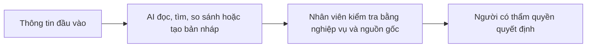
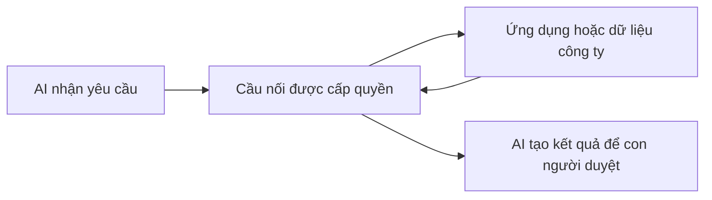
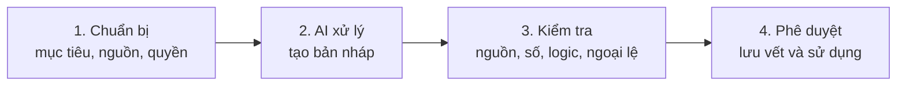

# AI trong công việc: hiểu đúng, chọn đúng, dùng đúng

> **Tài liệu học chính dành cho nhân sự không chuyên IT**  
> Áp dụng cho toàn công ty, bao gồm Be Better Foundation  
> Thời điểm đánh giá dự kiến: đầu tháng 11/2026 — được kiểm tra lại tối đa 2 lần

---

## 1. Vì sao phải dùng AI khi tôi vẫn đang làm việc tốt?

Đây là câu hỏi đúng và cần được trả lời trước khi học bất kỳ công cụ nào.

Một người làm việc tốt thường đã có kiến thức chuyên môn, biết quy trình và chịu trách nhiệm về kết quả. AI không phủ nhận những năng lực đó. AI giúp người có chuyên môn **giảm thời gian cho phần việc lặp lại**, dành nhiều thời gian hơn cho kiểm tra, phán đoán và tạo giá trị.

Ví dụ, một kế toán vẫn phải hiểu chứng từ, kỳ hạch toán và quy định thuế. Nhưng họ không nhất thiết phải tự đọc thủ công 200 dòng mô tả giao dịch để phân nhóm ban đầu. Một nhân viên marketing vẫn phải hiểu khách hàng và thương hiệu, nhưng không nhất thiết phải bắt đầu mọi bản nháp từ trang trắng.

Vấn đề gốc không phải là “con người làm chưa tốt”, mà là:

- Khối lượng thông tin tăng nhanh hơn thời gian làm việc.
- Nhiều thao tác lặp lại đang tiêu tốn thời gian của người có chuyên môn.
- Tốc độ phản hồi ngày càng quan trọng.
- Doanh nghiệp cần giảm chi phí nhưng vẫn tăng sản lượng và chất lượng.

AI tạo ra lợi thế khi nó rút ngắn đường đi từ dữ liệu đến quyết định:



**Nguyên tắc quan trọng nhất:** AI hỗ trợ xử lý; con người chịu trách nhiệm. Không giao cho AI quyền tự xác nhận số liệu, hạch toán, kê khai thuế, phát hành nội dung hoặc phê duyệt thanh toán.

### Dùng AI có thực sự hiệu quả không?

Không đánh giá bằng cảm giác. Chọn một công việc lặp lại, thực hiện 3–5 lần và ghi bốn chỉ số:

| Chỉ số | Câu hỏi cần trả lời |
|---|---|
| Thời gian | Trước và sau khi dùng AI mất bao lâu? |
| Chất lượng | Có giảm lỗi, thiếu ý hoặc số lần sửa không? |
| Sản lượng | Trong cùng thời gian làm được thêm bao nhiêu? |
| Rủi ro | Có lộ dữ liệu, dùng sai nguồn hoặc tạo kết quả sai không? |

Chỉ giữ cách dùng giúp **tiết kiệm thời gian mà vẫn kiểm soát được chất lượng và rủi ro**.

---

## 2. Hiểu AI từ nguyên lý gốc

AI tạo sinh là hệ thống nhận dữ liệu và chỉ dẫn, sau đó dự đoán để tạo ra câu trả lời phù hợp. Nó không “biết” và không chịu trách nhiệm như con người. Vì vậy, câu trả lời có thể trôi chảy nhưng vẫn sai.

### AI mạnh ở đâu?

| Năng lực | Công việc phù hợp | Ví dụ |
|---|---|---|
| Đọc và viết ngôn ngữ | Tóm tắt, soạn nháp, chuẩn hóa cách diễn đạt | Chuyển biên bản họp thành danh sách việc cần làm |
| Tìm và tổng hợp | Thu thập nhiều nguồn, tìm điểm giống và khác | So sánh ba chính sách hoặc tổng hợp xu hướng thị trường |
| Nhìn hình ảnh | Đọc ảnh, bảng, hóa đơn hoặc ảnh chụp màn hình | Trích trường thông tin từ hóa đơn để người dùng kiểm tra |
| Phân tích dữ liệu | Làm sạch, phân nhóm, tính toán, tìm bất thường | So sánh ngân sách với thực tế và chỉ ra chênh lệch |
| Tạo nội dung đa phương tiện | Tạo hoặc chỉnh sửa hình ảnh, video, bố cục | Làm ba phương án hình minh họa cho chiến dịch |
| Dùng công cụ | Tìm file, đọc hệ thống, chạy phép tính, thực hiện nhiều bước | Lấy dữ liệu được cấp quyền rồi lập báo cáo nháp |

### Vì sao AI có thể bịa hoặc tính sai?

AI thường tạo câu trả lời có vẻ hợp lý nhất, không mặc định kiểm chứng sự thật. Nó có thể sai khi thiếu dữ liệu, hiểu nhầm kỳ báo cáo, đọc sai ảnh, dùng nguồn cũ, bỏ qua ngoại lệ hoặc tự suy ra con số chưa được cung cấp.

Do đó, không yêu cầu chung chung: “Hãy làm báo cáo này thật chính xác.” Hãy thiết kế nhiệm vụ để sai sót dễ bị phát hiện:

1. Chỉ rõ nguồn nào được phép dùng.
2. Yêu cầu ghi nguồn hoặc vị trí dữ liệu cho từng kết luận quan trọng.
3. Tách dữ liệu gốc, phép tính, nhận xét và giả định thành các phần riêng.
4. Yêu cầu AI ghi “không đủ dữ liệu” thay vì đoán.
5. Tính lại số quan trọng bằng Excel/Google Sheets hoặc công cụ tính toán độc lập.
6. Đối chiếu tổng, số dư đầu kỳ–cuối kỳ, số dòng và các ngoại lệ.
7. Người có chuyên môn duyệt trước khi sử dụng.

### Mô hình, ngữ cảnh và chỉ dẫn là gì?

- **Mô hình** là “bộ não” AI. Mô hình nhanh/nhẹ phù hợp việc đơn giản, khối lượng lớn; mô hình suy luận mạnh phù hợp việc khó nhưng thường tốn thời gian và chi phí hơn.
- **Ngữ cảnh (context)** là toàn bộ thông tin AI đang được phép nhìn thấy: câu hỏi, file, lịch sử trao đổi, hướng dẫn và dữ liệu từ công cụ. Thiếu ngữ cảnh thì AI phải đoán; ngữ cảnh lẫn lộn thì AI dễ hiểu sai.
- **Prompt** là yêu cầu tại một thời điểm. Prompt tốt nêu rõ mục tiêu, dữ liệu, quy tắc, đầu ra và cách tự kiểm tra.
- **Instruction** là quy tắc dùng lặp lại. Có thể đặt ở cấp tổ chức/hệ thống, cấp ứng dụng hoặc cấp dự án. Cấp cao hơn quy định nguyên tắc chung; cấp thấp hơn bổ sung yêu cầu cụ thể và không được trái với cấp trên.

Chọn mô hình bằng thử nghiệm trên cùng một bộ việc mẫu. Tổng chi phí không chỉ là phí tài khoản: còn gồm thời gian chờ, thời gian kiểm tra và chi phí sửa sai.

---

## 3. Bản đồ công cụ: gặp việc gì thì dùng cái gì?

Không cần nhớ hàng chục tên sản phẩm. Chỉ cần xác định công việc thuộc nhóm nào và bắt đầu bằng công cụ đơn giản nhất đủ dùng.

### Nhóm A — Làm việc với nội dung

| Công cụ | Dùng khi nào | Cách hoạt động và cách dùng hiệu quả |
|---|---|---|
| **Chat** | Một câu hỏi hoặc một đầu ra ngắn | Trao đổi trực tiếp với AI. Cung cấp mục tiêu, dữ liệu cần thiết và mẫu đầu ra. Phù hợp soạn email, tóm tắt, giải thích hoặc tạo bản nháp; không phù hợp để tự quản lý một quy trình dài. |
| **Project** | Nhiều cuộc trao đổi cùng thuộc một công việc | Gom file, hướng dẫn và hội thoại vào một không gian chung để AI duy trì bối cảnh. Mỗi dự án chỉ nên có một mục tiêu rõ; đặt tên file, phiên bản và kỳ báo cáo nhất quán. |
| **Work / CoWork** | Nhiệm vụ có nhiều bước và nhiều tài liệu | AI lập kế hoạch, xử lý lần lượt và tạo sản phẩm có thể kiểm tra. Nêu rõ điểm nào AI được tự làm, điểm nào phải dừng xin duyệt. Không giao quyền rộng hơn mức cần thiết. Tên và phạm vi tính năng có thể khác theo gói/phiên bản. |
| **Skill** | Một cách làm tốt cần được dùng lại | Đóng gói hướng dẫn, mẫu, tiêu chuẩn và bước kiểm tra thành “quy trình nghề nghiệp” cho AI. Ví dụ: skill lập báo cáo công nợ phải luôn kiểm tra tổng, tuổi nợ, ngoại lệ và dẫn nguồn. Skill không phải kiến thức thần kỳ; chất lượng phụ thuộc vào quy trình được viết vào đó. |

### Nhóm B — Tìm và đọc thông tin

| Công cụ | Dùng khi nào | Cách hoạt động và cách dùng hiệu quả |
|---|---|---|
| **Web Search** | Cần một thông tin hiện hành hoặc vài nguồn cụ thể | AI tìm trên web rồi tóm tắt. Yêu cầu ưu tiên nguồn chính thức, ghi ngày và gắn liên kết ngay cạnh kết luận. Mở nguồn gốc để kiểm tra trước khi dùng. |
| **Deep Research** | Câu hỏi rộng, cần nhiều nguồn và so sánh có hệ thống | AI tự chia câu hỏi, tìm nhiều nguồn và tổng hợp thành báo cáo. Trước khi chạy, chốt phạm vi, thời gian, thị trường và tiêu chí đánh giá. Không dùng báo cáo nghiên cứu làm bằng chứng duy nhất cho quyết định quan trọng. |
| **Vision / OCR** | Dữ liệu nằm trong ảnh, PDF scan, hóa đơn hoặc biểu mẫu | Vision hiểu bố cục và nội dung hình; OCR chuyển ký tự trong ảnh thành văn bản. Ảnh mờ, dấu thập phân, mã số thuế và chữ viết tay dễ bị đọc sai. Luôn đối chiếu trường quan trọng với chứng từ gốc. |

### Nhóm C — Phân tích và tạo sản phẩm

| Công cụ | Dùng khi nào | Cách hoạt động và cách dùng hiệu quả |
|---|---|---|
| **Excel/Sheets và công cụ phân tích dữ liệu** | Cần tính toán, lọc, đối chiếu hoặc biểu đồ | AI có thể đề xuất công thức, làm sạch bảng và giải thích chênh lệch. Giữ nguyên file gốc, làm trên bản sao; khóa định dạng số; kiểm tra tổng kiểm soát và ô mẫu. Phép tính quan trọng phải nằm trong bảng tính để có thể xem lại, không chỉ xuất hiện trong câu trả lời. |
| **Tạo ảnh/video và Claude Design** | Cần bản nháp hình ảnh, video, bố cục hoặc ý tưởng thiết kế | Cung cấp mục tiêu, đối tượng, kích thước, thông điệp, nhận diện thương hiệu và điều cấm. Kiểm tra bản quyền, logo, chính tả, khuôn mặt và thông tin sản phẩm trước khi xuất bản. Khả năng cụ thể tùy tài khoản và phiên bản. |
| **Codex / Claude Code** | Công việc liên quan mã nguồn, file có cấu trúc, tự động hóa hoặc xử lý dữ liệu bằng chương trình | Công cụ có thể đọc thư mục được cho phép, sửa file, chạy lệnh và kiểm thử. Người không chuyên IT dùng khi có bài toán rõ và có người kỹ thuật duyệt. Luôn yêu cầu giải thích thay đổi, tạo bản sao/kiểm soát phiên bản và chạy kiểm tra trước khi dùng kết quả. |

### Nhóm D — Kết nối và tự động hóa

Đây là nhóm dễ nhầm nhất. Có thể hiểu theo một chuỗi đơn giản:



| Khái niệm | Bản chất | Ví dụ dễ hiểu | Lưu ý |
|---|---|---|---|
| **Connector** | Kết nối dựng sẵn giữa AI và một dịch vụ | Cho AI tìm tài liệu trong Google Drive hoặc đọc lịch được cấp quyền | Chỉ thấy dữ liệu trong phạm vi tài khoản và quyền đã cấp. Kiểm tra quyền trước khi kết nối. |
| **Plugin** | Gói mở rộng bổ sung một khả năng hoàn chỉnh | Một plugin có thể chứa hướng dẫn, công cụ kết nối và giao diện phục vụ một nghiệp vụ | Chỉ cài từ nguồn tin cậy; xem plugin được đọc và làm gì. Plugin là “gói tính năng”, không đồng nghĩa với MCP. |
| **MCP** | Một chuẩn chung để AI khám phá và gọi các công cụ/dữ liệu bên ngoài theo cách thống nhất | Thay vì xây một kiểu kết nối riêng cho từng AI, hệ thống công ty cung cấp một “quầy giao dịch chuẩn”; AI xem được dịch vụ nào có sẵn rồi gọi dịch vụ được phép | MCP không tự làm dữ liệu đúng và không tự bảo mật. Máy chủ MCP, quyền truy cập và từng thao tác vẫn phải được kiểm soát. |
| **API** | Cửa giao tiếp có quy tắc để hai phần mềm trao đổi với nhau | Hệ thống kế toán nhận yêu cầu “lấy danh sách hóa đơn tháng 9” và trả dữ liệu theo cấu trúc xác định | Thường cần đội kỹ thuật triển khai; phải quản lý khóa truy cập, nhật ký và giới hạn sử dụng. |
| **Agent / Automation / Scheduled workflow** | AI thực hiện một chuỗi bước theo mục tiêu, có thể chạy theo sự kiện hoặc lịch | Mỗi thứ Hai lấy dữ liệu được duyệt, lập báo cáo nháp, kiểm tra tổng và gửi người phụ trách xem | Chỉ tự động hóa quy trình đã ổn định. Bắt đầu ở chế độ tạo bản nháp; giữ bước phê duyệt trước hành động có hậu quả. |

#### MCP hoạt động như thế nào, nói bằng ngôn ngữ đời thường?

Hãy tưởng tượng AI là một nhân viên mới, còn các hệ thống công ty là những tủ hồ sơ khóa. **MCP giống quầy tiếp nhận có danh mục dịch vụ và kiểm soát quyền**:

1. Quầy cho AI biết có thể yêu cầu những việc gì, chẳng hạn “tìm hợp đồng” hoặc “đọc danh sách hóa đơn”.
2. AI gửi yêu cầu theo mẫu chuẩn.
3. Hệ thống kiểm tra danh tính và quyền.
4. Công cụ thực hiện yêu cầu rồi trả kết quả.
5. AI dùng kết quả để tạo bản nháp; con người kiểm tra và quyết định.

MCP hữu ích khi doanh nghiệp có nhiều nguồn dữ liệu hoặc muốn cùng một công cụ nội bộ dùng được với nhiều hệ sinh thái AI. Nhân viên nghiệp vụ không cần lập trình MCP, nhưng cần biết **AI đang truy cập nguồn nào, có quyền gì và thao tác nào cần phê duyệt**.

### Ba hệ sinh thái dùng trong công ty

| Hệ sinh thái | Nên học gì trước | Dùng nổi bật cho |
|---|---|---|
| **OpenAI** | ChatGPT, Project/Work, Codex, skill và kết nối | Hội thoại, công việc tri thức, phân tích dữ liệu, tạo nội dung và tác vụ kỹ thuật |
| **Claude** | Claude, Project, CoWork, Claude Code, skill và tính năng thiết kế | Đọc/viết tài liệu dài, công việc nhiều bước, thiết kế và tác vụ kỹ thuật |
| **Gemini** | Gemini, Gem, Deep Research, tạo/xử lý ảnh-video, Google AI Studio | Công việc gắn với hệ sinh thái Google, nghiên cứu và thử nghiệm mô hình |

**Gem** là một phiên bản Gemini được cấu hình cho nhiệm vụ lặp lại bằng hướng dẫn riêng. **Google AI Studio** là môi trường thử mô hình, prompt và cấu hình nâng cao; nhân viên nghiệp vụ dùng để thử nghiệm có kiểm soát, không đưa dữ liệu nhạy cảm vào khi chưa được cho phép.

Cách phân biệt nhanh:

- Việc ngắn, cần trao đổi: dùng **Chat**.
- Việc kéo dài, nhiều tài liệu: tạo **Project**.
- Việc nhiều bước: dùng **Work/CoWork** nếu tài khoản có.
- Việc kỹ thuật hoặc xử lý file bằng chương trình: dùng **Codex/Claude Code**, có kiểm tra.
- Việc lặp lại theo một chuẩn: tạo **Skill**.
- Cần dữ liệu bên ngoài: dùng **Connector/MCP/API** theo quyền được cấp.
- Quy trình ổn định và lặp định kỳ: mới xem xét **Agent/Automation**.

---

## 4. Cách giao việc để AI cho kết quả tốt và ít sai nhất

### Một yêu cầu tốt gồm sáu mảnh

> **Vai trò + Mục tiêu + Dữ liệu + Quy tắc + Đầu ra + Tự kiểm tra**

Đây không phải sáu từ để học thuộc. Mỗi phần giải quyết một nguyên nhân khiến AI trả lời sai:

| Thành phần | Hiểu đơn giản là gì? | Viết như thế nào? | Nếu thiếu thì điều gì xảy ra? |
|---|---|---|---|
| **Vai trò** | Góc nhìn chuyên môn AI cần dùng để hỗ trợ người làm việc | “Bạn là trợ lý cho kế toán công nợ, nhiệm vụ là chuẩn bị bản nháp để kế toán kiểm tra.” | AI có thể trả lời quá chung hoặc dùng sai cách diễn đạt. Vai trò không biến AI thành người có chứng chỉ và không chuyển trách nhiệm cho AI. |
| **Mục tiêu** | Việc cần hoàn thành và kết quả đó dùng để làm gì | “Phân tích công nợ đến ngày 30/09 để kế toán trưởng xác định khách hàng cần ưu tiên thu hồi.” | AI không biết nên tập trung vào vấn đề nào và dễ tạo một báo cáo dài nhưng không giúp ra quyết định. |
| **Dữ liệu** | Nguồn thông tin AI được phép sử dụng, gồm file, sheet, kỳ và phạm vi | “Chỉ dùng file `Cong_no_2026-09.xlsx`, sheet `AR`; cột số tiền dùng đơn vị VND.” | AI có thể lấy nhầm kỳ, nhầm sheet, dùng kiến thức bên ngoài hoặc tự bổ sung dữ kiện. |
| **Quy tắc** | Định nghĩa nghiệp vụ, điều kiện, ngưỡng và những việc bị cấm | “Tuổi nợ tính từ ngày đến hạn đến 30/09; chia 0–30, 31–60, 61–90 và trên 90 ngày; không đoán ô trống.” | AI có thể dùng cách tính hoặc tiêu chuẩn khác với công ty. |
| **Đầu ra** | Hình dạng sản phẩm cần nhận, đối tượng đọc và mức độ chi tiết | “Xuất bảng gồm khách hàng, chứng từ, ngày đến hạn, số ngày quá hạn, số tiền và mức ưu tiên; sau bảng có tóm tắt năm dòng.” | AI có thể trả một đoạn văn khó kiểm tra, thiếu cột hoặc không phù hợp với người nhận. |
| **Tự kiểm tra** | Các phép đối chiếu AI phải làm và bằng chứng phải trình bày trước khi trả kết quả | “Đối chiếu tổng tiền đầu vào–đầu ra, đếm số dòng, liệt kê dòng thiếu dữ liệu và ghi `CẦN KIỂM TRA` nếu không chắc.” | Lỗi có thể bị che trong một câu trả lời nghe rất tự tin. Tự kiểm tra giúp phát hiện lỗi, không bảo đảm AI đúng tuyệt đối. |

#### Cách viết prompt từ một công việc đang làm

Không bắt đầu bằng câu chữ hoa mỹ. Lấy chính quy trình công việc và trả lời lần lượt sáu câu:

1. AI đang **hỗ trợ ai**, ở công đoạn nào?
2. Sau khi AI làm xong, người sử dụng cần **quyết định hoặc hoàn thành việc gì**?
3. AI được dùng **đúng những file, sheet, cột, kỳ và nguồn nào**?
4. Công ty đang dùng **định nghĩa, ngưỡng, công thức và điều cấm nào**?
5. Người nhận cần **bảng, email, báo cáo hay checklist**, gồm những trường nào?
6. Có thể dùng **tổng kiểm soát, nguồn gốc, công thức hoặc mẫu đối chiếu nào** để phát hiện sai?

Điền câu trả lời vào mẫu sau:

```text
VAI TRÒ: Bạn hỗ trợ [bộ phận/người phụ trách] thực hiện [công đoạn].

MỤC TIÊU: Hãy [việc cần làm] để [người sử dụng] có thể [quyết định/hành động].

DỮ LIỆU: Chỉ sử dụng [tên file/nguồn], kỳ [thời gian], phạm vi [sheet/cột/dòng].
Nếu thiếu dữ liệu, hãy hỏi hoặc đánh dấu thiếu; không tự bổ sung.

QUY TẮC: Áp dụng [định nghĩa/công thức/ngưỡng/quy trình].
Không được [những việc bị cấm].

ĐẦU RA: Trả kết quả dưới dạng [bảng/email/báo cáo/checklist], gồm [các trường],
dành cho [người đọc], độ dài [giới hạn nếu có].

TỰ KIỂM TRA: Trước khi trả kết quả, hãy [đối chiếu tổng/đếm dòng/kiểm tra nguồn],
liệt kê [ngoại lệ/dữ liệu thiếu/giả định] và đánh dấu phần chưa chắc chắn.
```

**Yêu cầu yếu:**

> Phân tích công nợ tháng này và làm báo cáo hay.

**Cùng công việc đó, viết đầy đủ hơn:**

> Bạn là trợ lý cho kế toán công nợ, chỉ chuẩn bị bản phân tích để kế toán kiểm tra. Hãy phân tích công nợ đến ngày 30/09/2026 để kế toán trưởng xác định khách hàng cần ưu tiên thu hồi. Chỉ dùng file `Cong_no_2026-09.xlsx`, sheet `AR`; số tiền tính bằng VND. Tuổi nợ tính từ ngày đến hạn đến 30/09/2026 và chia thành 0–30, 31–60, 61–90 và trên 90 ngày. Không tự điền ô trống và không suy đoán nguyên nhân chậm trả. Tạo bảng gồm khách hàng, số chứng từ, ngày đến hạn, số ngày quá hạn, số tiền, nhóm tuổi nợ và mức ưu tiên; sau bảng viết tóm tắt tối đa năm dòng. Trước khi trả kết quả, đối chiếu tổng tiền và số dòng đầu vào–đầu ra, liệt kê dòng thiếu ngày hoặc số tiền và ghi `CẦN KIỂM TRA` tại mọi điểm chưa chắc chắn.

Prompt dài hơn không mặc nhiên tốt hơn. Prompt tốt là prompt chứa **đủ điều kiện để làm đúng và đủ dấu vết để kiểm tra**. Với việc phức tạp, yêu cầu AI làm từng bước thay vì dồn tất cả vào một câu lệnh.

### Quy trình bốn chặng



1. **Chuẩn bị:** xác định đầu ra, nguồn được dùng, dữ liệu nào được phép đưa vào và ai là người duyệt.
2. **AI xử lý:** giao từng chặng; yêu cầu AI nêu dữ liệu thiếu, giả định và phần chưa chắc chắn.
3. **Kiểm tra:** đối chiếu với nguồn gốc, công cụ tính toán và quy tắc nghiệp vụ.
4. **Phê duyệt:** người chịu trách nhiệm xác nhận, lưu phiên bản và chỉ sau đó mới phát hành hoặc thực hiện hành động.

### Năm kiểm tra bắt buộc

| Kiểm tra | Cách làm |
|---|---|
| Nguồn | Mở lại file/link gốc; xác nhận đúng phiên bản, kỳ và phạm vi |
| Số liệu | Tính lại bằng Excel/Sheets; kiểm tra tổng, số dòng, đơn vị và dấu thập phân |
| Logic | So với chính sách, quy trình và hiểu biết nghiệp vụ; tìm trường hợp ngoại lệ |
| Bảo mật | Không đưa mật khẩu, khóa truy cập, dữ liệu cá nhân hoặc bí mật kinh doanh vào công cụ chưa được duyệt |
| Đầu ra | Kiểm tra người nhận, tệp đính kèm, giọng điệu và quyền phê duyệt trước khi gửi |

Dừng và hỏi người phụ trách khi nguồn mâu thuẫn, dữ liệu thiếu, AI không dẫn được chứng cứ, kết quả ảnh hưởng tiền/thuế/pháp lý, hoặc công cụ yêu cầu quyền vượt quá nhiệm vụ.

---

## 5. Học bằng công việc thật và triển khai trong công ty

### Kế toán trưởng có thể ứng dụng AI vào việc gì?

Kế toán trưởng nên dùng AI như **trợ lý tổng hợp, trợ lý kiểm soát và trợ lý phân tích**, không dùng AI làm người phê duyệt. Các ứng dụng nên đi từ ít rủi ro đến nhiều kiểm soát:

| Công việc | AI chuẩn bị hoặc phát hiện | Kế toán trưởng chịu trách nhiệm |
|---|---|---|
| Đóng sổ cuối tháng | Checklist, việc còn thiếu, tài khoản biến động lớn và bút toán cần chú ý | Xác minh và phê duyệt bút toán, số liệu khóa sổ |
| Báo cáo quản trị | So sánh thực tế–ngân sách–kỳ trước, tạo bản nháp giải trình | Xác nhận nguyên nhân và thông điệp gửi lãnh đạo |
| Dự báo dòng tiền | Tổng hợp lịch thu–chi, lập kịch bản cơ sở/tốt/xấu, cảnh báo tuần thiếu tiền | Chọn giả định và quyết định phương án tài chính |
| Công nợ phải thu | Phân nhóm tuổi nợ, xếp thứ tự khoản cần thu, soạn danh sách theo dõi | Đánh giá khả năng thu và quyết định cách xử lý |
| Công nợ phải trả và chứng từ | Trích thông tin, tìm hóa đơn trùng, sai trường dữ liệu hoặc hồ sơ thiếu | Đối chiếu chứng từ và phê duyệt thanh toán |
| Kiểm soát nội bộ | Đánh dấu giao dịch bất thường, vượt hạn mức, thiếu phê duyệt hoặc có dấu hiệu chia nhỏ | Điều tra nguyên nhân; AI không được kết luận gian lận |
| Thuế và chính sách | Tìm nguồn chính thức, tóm tắt thay đổi, lập bảng so sánh quy định | Đọc văn bản gốc, đánh giá trường hợp thực tế và kết luận nghiệp vụ |
| Hồ sơ kiểm toán | Lập danh mục tài liệu, phát hiện hồ sơ thiếu, soạn bản giải trình ban đầu | Chịu trách nhiệm về bằng chứng và nội dung cung cấp |
| Quy trình và đào tạo | Viết SOP, checklist, câu hỏi tình huống và tài liệu cho nhân viên mới | Ban hành quy trình, phân quyền và kiểm tra việc thực hiện |
| Tư vấn ban lãnh đạo | Chuyển số liệu thành xu hướng, nguyên nhân, rủi ro và các kịch bản | Đưa ra khuyến nghị dựa trên chiến lược và thực tế doanh nghiệp |

Ba bài toán nên thí điểm trước là **báo cáo biến động tháng**, **dự báo dòng tiền 13 tuần** và **rà soát công nợ/chứng từ theo ngoại lệ**. Chúng lặp lại thường xuyên, dễ đo thời gian trước–sau và vẫn giữ được bước kiểm tra của kế toán trưởng.

### Ba ví dụ liền mạch

**Ví dụ 1 — Báo cáo công nợ hàng tuần**

Kế toán bắt đầu bằng Chat để thiết kế mẫu báo cáo. Khi công việc lặp lại, tạo Project chứa quy định và mẫu chuẩn; sau đó tạo Skill mô tả các bước kiểm tra. Nếu dữ liệu nằm trong hệ thống, đội kỹ thuật có thể cấp Connector/MCP/API để lấy đúng dữ liệu. Chỉ khi quy trình đã ổn định mới lập lịch chạy tự động. Mỗi lần chạy vẫn phải đối chiếu tổng và có kế toán duyệt.

**Ví dụ 2 — Chuẩn bị chiến dịch marketing**

Nhân viên dùng Deep Research để tổng hợp thị trường từ nguồn có ngày và liên kết; dùng Project để giữ brief, chân dung khách hàng và quy chuẩn thương hiệu; dùng Chat để phát triển thông điệp; dùng công cụ ảnh/video để tạo phương án minh họa. Trước khi phát hành, người phụ trách kiểm tra nguồn, tuyên bố sản phẩm, bản quyền và sự nhất quán thương hiệu.

**Ví dụ 3 — Xử lý bộ chứng từ thanh toán**

Vision/OCR trích số hóa đơn, ngày, mã số thuế và số tiền vào bảng nháp. AI đánh dấu trường không rõ thay vì tự điền. Excel/Sheets kiểm tra trùng, tổng và điều kiện; nhân viên đối chiếu từng ngoại lệ với chứng từ gốc. AI không phê duyệt thanh toán và không thay người chịu trách nhiệm.

### Lộ trình bốn tuần

| Tuần | Học và làm | Kết quả cần có |
|---|---|---|
| 1 — Hiểu đúng | Học nguyên lý, bảo mật, prompt sáu mảnh; làm ba tác vụ nhỏ | 3 kết quả đã đối chiếu với cách làm cũ |
| 2 — Chọn đúng | Thử Chat, Project, tìm kiếm/nghiên cứu, xử lý file; so sánh hai mô hình trên cùng một việc | Bảng chọn công cụ và ghi nhận thời gian/chất lượng |
| 3 — Chuẩn hóa | Viết instruction cho dự án hoặc Gem; tạo một Skill/SOP đơn giản; thực hành quy trình bốn chặng | 1 quy trình lặp lại có checklist kiểm tra |
| 4 — Áp dụng | Chạy quy trình trên dữ liệu được phép; đo hiệu quả; trình bày kết quả và rủi ro | 1 tình huống thực tế đủ bằng chứng để đánh giá |

### Yêu cầu thực hiện

- Cài ứng dụng desktop Claude và ChatGPT/Codex theo hướng dẫn của công ty; Gemini sử dụng bằng tài khoản công ty theo gói được cấp.
- Người đã có tài khoản làm việc riêng tiếp tục dùng để học; người chưa có tài khoản đăng ký bản miễn phí bằng email công ty theo quy định.
- Chỉ sử dụng tài khoản trả phí và các kết nối do công ty cấp sau khi hoàn thành giai đoạn cơ bản.
- Dành 30 phút đến 2 giờ mỗi ngày trong giờ làm việc tùy lưu lượng công việc; nên cố định một khung giờ.
- Khi gặp khó khăn về cài đặt, tài khoản, quyền truy cập hoặc kỹ thuật, báo Thảo (Grace) hoặc Thanh IT.

### KPI nên đo

- Hoàn thành lộ trình và bài kiểm tra đầu tháng 11/2026.
- Có ít nhất một quy trình công việc thật được cải thiện và có số liệu trước–sau.
- Giảm thời gian nhưng không tăng lỗi hoặc vi phạm bảo mật.
- Biết giải thích vì sao chọn Chat, Project, Work/CoWork, Skill, Deep Research, Connector, MCP hoặc công cụ khác.
- Biết phát hiện giới hạn của AI và thực hiện đủ bước kiểm tra trước khi sử dụng kết quả.

---

### Tờ ghi nhớ một trang

1. **Tôi đang giải quyết việc gì?** Viết đầu ra mong muốn trong một câu.
2. **AI cần biết gì?** Chỉ cung cấp đúng nguồn, đúng kỳ, đúng phạm vi và đúng quyền.
3. **Dùng công cụ nào?** Chat cho việc ngắn; Project cho việc dài; Work/CoWork cho nhiều bước; Skill cho quy trình lặp; Connector/MCP/API cho dữ liệu ngoài; Automation chỉ khi quy trình đã ổn định.
4. **AI có thể sai ở đâu?** Nguồn, số liệu, logic, ngoại lệ, bảo mật và hành động.
5. **Tôi kiểm tra bằng gì?** Chứng từ gốc, nguồn chính thức, bảng tính, quy trình nghiệp vụ và người có thẩm quyền.
6. **Kết quả có tạo giá trị không?** Đo thời gian, chất lượng, sản lượng và rủi ro.

> **Câu cần nhớ:** Không học AI để trò chuyện nhiều hơn. Học AI để giao đúng việc, kiểm soát đúng rủi ro và tạo ra kết quả tốt hơn có thể đo được.

---

### Nguồn học chính thức

- OpenAI — [ChatGPT và Codex: tình huống sử dụng](https://learn.chatgpt.com/use-cases)
- Anthropic — [Bắt đầu với Claude Code](https://docs.anthropic.com/en/docs/claude-code/getting-started)
- Google — [Tạo và dùng Gems](https://support.google.com/gemini/answer/15236321?hl=en)
- Google — [Deep Research trong Gemini](https://support.google.com/gemini/answer/15719111?hl=en)
- Google — [Google AI Studio](https://ai.google.dev/aistudio)

> Tên tính năng, phạm vi truy cập và giới hạn sử dụng có thể thay đổi theo thời điểm, hệ điều hành và gói tài khoản. Khi học hoặc triển khai, ưu tiên tài liệu chính thức và quy định nội bộ hiện hành.
